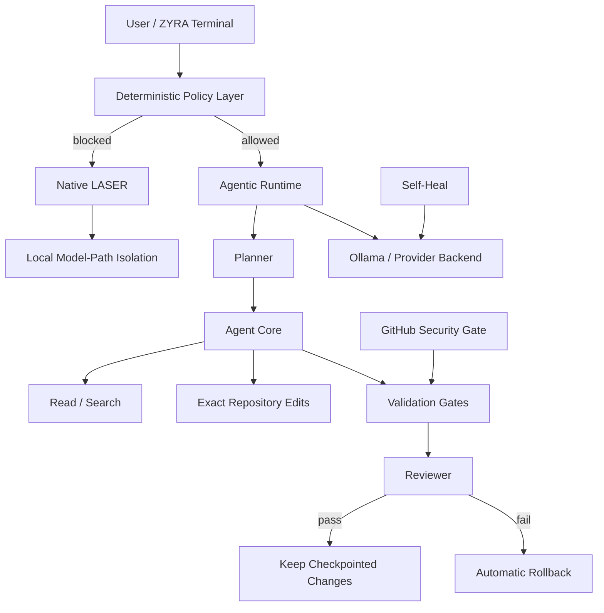

<div align="center">


# 🟣 ZYRA // AGENTIC GPT-DOUG-LLM

**Local-first autonomous coding runtime · deterministic guardrails · checkpointed self-improvement**


[](https://github.com/sonoxo/gpt-doug-llm/actions/workflows/security-gate.yml)
[](https://github.com/sonoxo/gpt-doug-llm/actions/workflows/unified-tests.yml)
[](LICENSE)
[](https://github.com/sonoxo/gpt-doug-llm/stargazers)
[](https://github.com/sonoxo/gpt-doug-llm/issues)
[](https://github.com/sonoxo/gpt-doug-llm/commits/main)

**EUREKA // Build anything useful. Keep humans in command.**

</div>

---

<div align="center">

### 🧭 Navigation

[Why ZYRA](#-why-zyra) · [Architecture](#-architecture) · [Quick Start](#-quick-start) · [Agent Mode](#-agent-mode) · [LASER](#-native-laser) · [Commands](#-terminal-command-center) · [Security](#-autonomy-contract) · [Roadmap](#-roadmap) · [Docs](#-documentation)

</div>

---

## ⚡ Why ZYRA

ZYRA turns GPT-DOUG-LLM into a **local agentic engineering environment** instead of a single chat loop. The runtime separates model reasoning from deterministic controls so planning can be flexible while execution stays inspectable and bounded.

| System | Role | Boundary |
|---|---|---|
| 🤖 **Agent Core** | Plans and executes repository coding missions | Repo-scoped tools, checkpoints, rollback, hard budgets |
| 🔴 **Native LASER** | Defensive circuit breaker | Intercept → isolate → recover; no retaliation |
| 🩺 **Self-Heal** | Repairs local provider/model runtime configuration | One bounded pass; no recursive repair loop |
| 🧠 **Agent Chain** | Planner → Executor → Reviewer orchestration | Depth and spawn budgets |
| 🧬 **Evolve Mode** | Improves ZYRA-owned agent/runtime/test code | Same checkpoint + validation gates |
| 🌐 **Web Runtime** | Local interface and streaming services | Explicitly configured execution |
| ⚙️ **Worker Fleet** | Queue-based background task processing | Repository-defined workers |
| 🛡️ **Security Gate** | CI tests, static analysis, dependency audit, SBOM | Runs on GitHub Actions |

### What makes it different

- **Local-first inference** through Ollama with provider-neutral backend code.
- **Autonomy with an audit trail**, not hidden background mutation.
- **Checkpoint-before-write** behavior for autonomous missions.
- **Automatic rollback** when a mission fails its final validation gate.
- **Native defensive isolation** when policy events reach LASER thresholds.
- **Human-controlled external boundaries**: the local agent does not gain arbitrary shell, push/deploy/send, or external-targeting tools.

---

## 🧠 Architecture



The guiding rule is simple: **models may propose; deterministic code decides what can execute.**

Deep dive: [docs/ARCHITECTURE.md](docs/ARCHITECTURE.md)

---

## 🚀 Quick Start

### 1. Clone

```bash
git clone https://github.com/sonoxo/gpt-doug-llm.git
cd gpt-doug-llm
```

### 2. Heal the local runtime

```bash
python3 dougctl.py heal
```

### 3. Launch ZYRA

```bash
python3 zyra_chat.py
```

A healthy launch should identify the local model, branch, self-heal status, LASER state, and Agent Core state before presenting:

```text
ZYRA >
```

### 4. Verify native systems

Inside ZYRA:

```text
/laser-test
/agent-test
/status
```

---

## 🤖 Agent Mode

ZYRA's Agent Core is designed for **bounded autonomous repository work**.

Default mission envelope:

```text
8 steps
240 seconds
12 model calls
repository scope only
checkpoint before write
auto-rollback on failed final gate
```

### Mission flow

```text
OBSERVE → PLAN → EDIT → TEST → REVIEW → KEEP / ROLLBACK
```

### Natural vibe-code commands

```text
/plan build a better fleet dashboard
/do add structured mission telemetry to the agent runtime
/evolve improve your own mission planning and error recovery
/mission-status
/undo
```

`/evolve` is not an unrestricted self-modification switch. It operates through the same bounded repository tools and validation path used by ordinary missions.

Deep dive: [docs/AGENTIC_RUNTIME.md](docs/AGENTIC_RUNTIME.md)

---

## 🔴 Native LASER

LASER is ZYRA's local defensive circuit breaker.

```text
normal request        → ALLOW
blocked input         → INTERCEPT
repeated violations   → ISOLATE
blocked model output  → ISOLATE immediately
recovery              → reset / timeout
```

The native self-test is deterministic and intentionally does **not** execute attack payloads or target external systems.

```text
/laser-test
/laser-status
/laser-reset
```

---

## 🩺 Runtime Self-Heal

Self-Heal repairs ZYRA's own local runtime wiring when the model/provider configuration drifts.

It can:

- reload persisted runtime environment settings;
- normalize provider selection;
- detect the local Ollama endpoint;
- start Ollama once when needed;
- select an installed compatible model;
- persist non-secret runtime settings.

It intentionally does not run recursive healing loops or silently download large models.

```bash
python3 dougctl.py heal
```

---

## ⌨️ Terminal Command Center

| Command | Purpose |
|---|---|
| `/status` | Full ZYRA runtime dashboard |
| `/fleet` | Agent + worker inventory |
| `/heal` | Run one bounded runtime repair pass |
| `/heal-status` | Show last self-heal report |
| `/laser-test` | Native LASER deterministic self-test |
| `/laser-status` | Circuit-breaker state |
| `/laser-reset` | Clear LASER lock/strike state |
| `/agent-test` | Native Agent Core safety/self-test |
| `/agent-status` | Mission envelope + last mission |
| `/plan <goal>` | Generate a bounded mission plan |
| `/do <goal>` | Execute a bounded repository mission |
| `/evolve <goal>` | Improve ZYRA-owned runtime/agent/test code |
| `/mission-status` | Show latest autonomous mission result |
| `/undo` | Restore the latest agent checkpoint |
| `/fast` | Lower-latency local chat mode |
| `/balanced` | Larger-context local chat mode |
| `/default-on` | Auto-open ZYRA in new interactive terminal windows |
| `/clear` | Clear conversation memory |
| `/quit` | Exit cleanly |

Full command reference: [docs/COMMANDS.md](docs/COMMANDS.md)

---

## 🛡️ Autonomy Contract

ZYRA is built around **capability boundaries**, not claims of unlimited autonomy.

### Agent Core can

- inspect text files inside the repository;
- search repository content;
- create and edit allowlisted text/code files;
- create checkpoints before mission-owned writes;
- run allowlisted validation gates;
- keep successful mission changes;
- roll back failed mission changes.

### Agent Core does not receive

- unrestricted arbitrary shell execution;
- arbitrary filesystem access outside the repository;
- autonomous credential harvesting;
- external offensive scanning or exploitation;
- automatic push/deploy/send tools;
- unbounded recursive sub-agent spawning.

For security policy and limitations, read [SECURITY.md](SECURITY.md) and [docs/SECURITY_BASELINE.md](docs/SECURITY_BASELINE.md).

---

## 🧩 Repository Map

```text
gpt-doug-llm/
├── zyra_chat.py             # Interactive ZYRA terminal
├── zyra_agent.py            # Bounded autonomous Agent Core
├── zyra_laser.py            # Native defensive circuit breaker
├── zyra_self_heal.py        # Local runtime repair
├── zyra.py                  # Deterministic watchdog/policy layer
├── dougctl.py               # Runtime control CLI
├── agents/                  # Planner, executor, reviewer, provider backend
├── workers/                 # Queue workers and orchestration services
├── web/                     # Local web platform
├── docs/                    # Architecture, security, APIs, roadmap
├── tests/                   # Core regression tests
└── .github/workflows/       # CI, security, releases, fleet automation
```

---

## ✅ CI / Engineering Gates

The repository includes dedicated workflows for:

- unified tests;
- Agent Core native self-test;
- LASER native self-test;
- Ruff linting;
- Bandit security analysis;
- dependency auditing;
- CycloneDX SBOM generation;
- Docker publishing;
- release automation;
- automated agent-fleet workflows.

The goal is not "AI generated = accepted." The goal is **generated → inspected → validated → accepted**.

---

## 🗺️ Roadmap

Current direction:

- [x] Local ZYRA conversational runtime
- [x] Runtime self-heal
- [x] Native LASER circuit breaker
- [x] Bounded Agent Core
- [x] Checkpoint + rollback missions
- [x] Agent/LASER CI gates
- [ ] Structured mission event journal
- [ ] DAG mission scheduler with dependency-aware execution
- [ ] Capability manifest per tool/agent
- [ ] Reproducible sandbox runner for generated apps
- [ ] Web mission console with live event streaming
- [ ] Signed autonomous-change attestations
- [ ] Release-grade benchmark suite for agent reliability

See [docs/ROADMAP.md](docs/ROADMAP.md).

---

## 📚 Documentation

| Document | Purpose |
|---|---|
| [Architecture](docs/ARCHITECTURE.md) | Runtime layers, trust boundaries, mission flow |
| [Agentic Runtime](docs/AGENTIC_RUNTIME.md) | Agent Core budgets, tools, checkpoints, rollback |
| [Commands](docs/COMMANDS.md) | ZYRA terminal command reference |
| [Roadmap](docs/ROADMAP.md) | Engineering milestones |
| [Security](SECURITY.md) | Vulnerability reporting + limitations |
| [Secure Development Baseline](docs/SECURE_DEVELOPMENT_BASELINE.md) | Engineering controls |
| [Contributing](CONTRIBUTING.md) | Development and pull-request process |

---

## 🤝 Contributing

PRs are welcome when they keep the runtime testable, deterministic at security boundaries, and understandable to another developer.

Start with [CONTRIBUTING.md](CONTRIBUTING.md), use the issue templates for bugs/features, and run the native Agent/LASER tests before opening a PR.

---

## 📄 License

MIT — see [LICENSE](LICENSE).

## ⚠️ Project Scope

GPT-DOUG-LLM and ZYRA are independent open-source software. References to external products, organizations, or engineering patterns do not imply endorsement, affiliation, authorization, or certification. ZYRA's policy and safety layers complement rather than replace OS sandboxing, least privilege, dependency review, and professional security assessment.

<div align="center">

### 🟣 ZYRA

**Build fast. Validate everything. Keep autonomy bounded by capability.**


</div>
