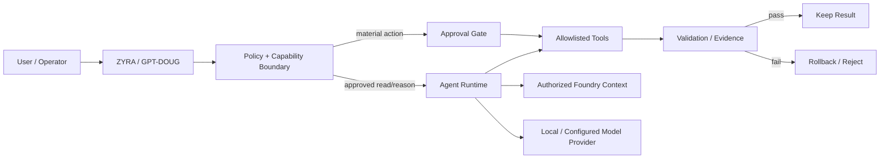

<div align="center">


# ZYRA // NXYZ PRODUCT PLATFORM

### Governed agentic infrastructure for software engineering, enterprise AI workflows, browser-guided operations, and local automation.

**Build with AI. Keep execution visible. Keep authority explicit.**

[](https://github.com/sonoxo/gpt-doug-llm/actions/workflows/security-gate.yml)
[](https://github.com/sonoxo/gpt-doug-llm/actions/workflows/unified-tests.yml)
[](LICENSE)


[Products](#products) · [Shadow Glass](#️-shadow-glass--federal-mission-nexus) · [Why ZYRA](#why-zyra) · [Architecture](#architecture) · [Foundry](#palantir-foundry-integration) · [Quick Start](#quick-start) · [Trust](#trust-and-control) · [Docs](#documentation)

</div>

---

## The product in one minute

ZYRA is the product layer around **GPT-DOUG-LLM / NXYZ**: a set of bounded agentic tools that can reason, navigate, edit, validate, and integrate with authorized systems without treating model output as automatic authority.

The platform is designed around a simple execution contract:

> **AI proposes → policy bounds → approved tools execute → validation produces proof → humans retain control of material actions.**

That makes the repository useful as more than a model experiment. It is a product platform for teams that want AI-assisted execution with explicit capability boundaries, auditability, and deployment discipline.

---

## ◼️ SHADOW GLASS // Federal Mission Nexus

<div align="center">


[](safety-shield/SHADOW_GLASS.md)
[](safety-shield/ontology/safety-shield.ttl)
[](safety-shield/SHADOW_GLASS.md)
[](safety-shield/SHADOW_GLASS.md)
[](safety-shield/SHADOW_GLASS.md)

**SHADOW GLASS shields GLASS ONION. GLASS ONION makes authority observable.**

</div>

```text
PUBLIC / AUTHORIZED SOURCES
            ↓
      SHADOW GLASS
 identity • provenance • confidence • policy
            ↓
       GLASS ONION
 intent • context • execution • evidence
            ↓
  PALANTIR-STYLE ONTOLOGY
       ↙       ↓       ↘
SPACE FORCE   NSA     NASA
 mission    defensive  open data /
 systems      cyber     software
            ↓
     THE BLACK HOUSE
            ↓
ZYRA • XUNIA • GPT-DOUG-LLM • VIRGINIA-LLM
```

The mission nexus maps public U.S. Space Force mission concepts, NSA defensive cybersecurity guidance, and NASA public mission data/software into a provenance-first operational ontology. **These are independent project mappings, not agency credentials or endorsements.**

[Open SHADOW GLASS control plane →](safety-shield/SHADOW_GLASS.md) · [Machine-readable ontology →](safety-shield/ontology/shadow-glass-palantir.json)

---

## Products

| Product | What it does | Best fit | Readiness |
| --- | --- | --- | --- |
| **ZYRA Core** | Bounded agentic software-engineering runtime with planning, repository edits, checkpoints, validation, rollback, self-heal, and defensive policy controls | Developers and technical teams building agentic workflows | **Implemented runtime** |
| **NXYZ Mouse Mic** | Voice/keyboard browser guidance that finds, highlights, and activates visible Foundry controls with high-impact confirmation | Accessibility, operator assistance, dense enterprise UI navigation | **v1.0.2 shipping candidate** |
| **GPT-DOUG ↔ Palantir Foundry Bridge** | Grounds GPT-DOUG in authorized Ontology objects and gates Foundry Actions behind explicit write enablement and user confirmation | Authorized Palantir Foundry deployments | **Integration-ready** |
| **Watch Dog** | Local dog detection + temporal scoring + alerting for suspected bathroom events | Edge-AI / smart-camera experimentation | **Experimental prototype** |

**Full portfolio:** [docs/PRODUCTS.md](docs/PRODUCTS.md)

### NXYZ Mouse Mic — first shippable utility

[`tools/nxyz-mouse-mic`](tools/nxyz-mouse-mic/README.md) is packaged as a Chrome Manifest V3 extension for supported Palantir Foundry pages.

- No paid API key required by the extension.
- No generic `<all_urls>` permission.
- Typed-command mode runs locally in the extension.
- Optional voice recognition uses the browser Web Speech implementation when available.
- `show targets`, `where is <label>`, `click <label>`, and numbered targeting.
- High-impact controls such as deploy/publish/approve/delete require explicit confirmation.
- Store specifications, privacy language, icons, and publishing checklist are maintained in the product folder.

[Mouse Mic source](tools/nxyz-mouse-mic/) · [Shipping specs](tools/nxyz-mouse-mic/SPECS.md) · [Privacy](tools/nxyz-mouse-mic/PRIVACY.md)

---

## Why ZYRA

Most AI tooling optimizes for generating an answer. ZYRA focuses on the harder step: **turning a model recommendation into a controlled operation**.

| Value | ZYRA approach |
| --- | --- |
| **Execution control** | Deterministic policy and allowlisted tools sit between model output and mutation |
| **Recoverability** | Checkpoint before mission-owned writes; rollback when final validation fails |
| **Operational evidence** | Tests, logs, previews, reports, and runtime state are treated as proof rather than decoration |
| **Enterprise context** | Foundry integration retrieves only context exposed to the configured authorized identity |
| **Local-first options** | Local/provider-neutral runtime paths reduce dependence on a single hosted model vendor |
| **Human authority** | Material external writes remain gated rather than silently delegated to the model |

### Where it can create value

- **Engineering teams:** turn natural-language goals into bounded repository missions.
- **Enterprise AI teams:** connect reasoning to governed Ontology context instead of copy/pasted data.
- **Operators and accessibility users:** navigate complex Foundry interfaces with spoken or typed guidance.
- **R&D teams:** prototype local edge/automation workflows without pretending experiments are production systems.

---

## Architecture



**Design rule:** model reasoning is flexible; execution authority is explicit.

Deep dive: [docs/ARCHITECTURE.md](docs/ARCHITECTURE.md) · [docs/AGENTIC_RUNTIME.md](docs/AGENTIC_RUNTIME.md)

---

## Palantir Foundry integration

The repository includes an implemented Foundry bridge for an **authorized Palantir enrollment**.

Implemented capabilities:

- OAuth client credentials or explicitly issued bearer-token configuration;
- list Ontologies and object types;
- read/search Ontology objects;
- inject authorized Ontology data into GPT-DOUG reasoning context;
- call Ontology Actions only when local writes are enabled **and** the user confirms;
- host pinning and explicit Foundry configuration boundaries.

```bash
python palantir_bridge.py status
python palantir_bridge.py ontologies
python palantir_bridge.py object-types <ontology>
python palantir_bridge.py analyze <ontology> <object_type> "your question"
```

The bridge does **not** manufacture credentials or grant tenant permissions. The connected Palantir identity and tenant policy remain authoritative.

Integration guide: [docs/PALANTIR_FOUNDRY.md](docs/PALANTIR_FOUNDRY.md)

---

## Quick Start

```bash
git clone https://github.com/sonoxo/gpt-doug-llm.git
cd gpt-doug-llm
python3 dougctl.py heal
python3 zyra_chat.py
```

Then verify the native runtime:

```text
/status
/agent-test
/laser-test
```

Typical agent mission:

```text
/plan add structured mission telemetry
/do add structured mission telemetry
/mission-status
```

Mission lifecycle:

```text
OBSERVE → PLAN → EDIT → TEST → REVIEW → KEEP / ROLLBACK
```

Full command reference: [docs/COMMANDS.md](docs/COMMANDS.md)

---

## Trust and control

ZYRA is intentionally marketed around what the software can demonstrate, not unlimited-autonomy language.

### Built-in boundaries

- repository-scoped agent tools;
- mission step/time/model-call budgets;
- checkpoint-before-write behavior;
- validation gates and rollback;
- defensive LASER circuit-breaker behavior;
- explicit Foundry write enablement;
- confirmation before configured material actions;
- no autonomous credential harvesting;
- no unrestricted external offensive scanning or exploitation;
- no claim that a local capability switch overrides an external platform's permissions.

Read [SECURITY.md](SECURITY.md) and [docs/SECURE_DEVELOPMENT_BASELINE.md](docs/SECURE_DEVELOPMENT_BASELINE.md).

---

## Product readiness

ZYRA uses explicit readiness labels so buyers, collaborators, and reviewers can distinguish working code from future architecture.

| Label | Meaning |
| --- | --- |
| **Implemented runtime** | Code exists in the repository and is intended to run with required local configuration |
| **Shipping candidate** | Product package/specs exist and are being prepared for external distribution |
| **Integration-ready** | Connector/runtime exists but requires customer/tenant authorization and configuration |
| **Experimental prototype** | Useful R&D code; not represented as production-grade detection or assurance |
| **Planned** | Architecture or roadmap item; do not treat as a currently deployed capability |

This status discipline is part of the product: **claims should be traceable to code, configuration, or evidence.**

---

## Repository map

```text
gpt-doug-llm/
├── zyra_chat.py                 # Interactive ZYRA runtime
├── zyra_agent.py                # Bounded repository Agent Core
├── zyra_laser.py                # Defensive circuit breaker
├── zyra_self_heal.py            # Local runtime repair
├── palantir_foundry.py          # Foundry REST client
├── palantir_bridge.py           # GPT-DOUG ↔ Foundry bridge
├── agents/                      # Planner / executor / reviewer components
├── workers/                     # Worker and orchestration services
├── tools/nxyz-mouse-mic/        # Chrome browser-guidance product
├── watch-dog/                   # Experimental local camera product
├── safety-shield/               # SHADOW GLASS + GLASS ONION defensive control plane
├── docs/                        # Product, architecture, integration, security docs
├── tests/                       # Regression tests
└── .github/workflows/           # CI / security / release automation
```

---

## Documentation

| Start here | Purpose |
| --- | --- |
| [SHADOW GLASS](safety-shield/SHADOW_GLASS.md) | Federal mission nexus, Glass Onion shield, ontology and control states |
| [Product Portfolio](docs/PRODUCTS.md) | What ZYRA products exist, buyer value, and readiness |
| [Architecture](docs/ARCHITECTURE.md) | Runtime layers and trust boundaries |
| [Agentic Runtime](docs/AGENTIC_RUNTIME.md) | Mission budgets, tools, checkpointing, rollback |
| [Palantir Foundry](docs/PALANTIR_FOUNDRY.md) | Authorized Foundry integration |
| [Commands](docs/COMMANDS.md) | Terminal command reference |
| [Roadmap](docs/ROADMAP.md) | Engineering direction |
| [Security](SECURITY.md) | Security limitations and vulnerability reporting |
| [Contributing](CONTRIBUTING.md) | Development workflow |

---

## Market-facing independence statement

**ZYRA, GPT-DOUG-LLM, NXYZ, SHADOW GLASS, GLASS ONION, TheBlackHouse, and repository-issued RVIA materials are independent software/project artifacts.** References to Palantir, the U.S. Space Force, NSA, NASA, government systems, intelligence/security disciplines, or external organizations describe integrations, public mission/reference mappings, research, interoperability goals, or design context. They do **not** imply federal-agency status, congressional authority, security clearance, certification, endorsement, contract award, or affiliation.

That distinction matters commercially: customers should know exactly which capabilities come from this repository and which permissions or assurances belong to the external platforms they operate.

---

## License

MIT — see [LICENSE](LICENSE).

<div align="center">

### ZYRA

**AI-assisted execution with visible boundaries, verifiable outcomes, and human authority where it matters.**

</div>
