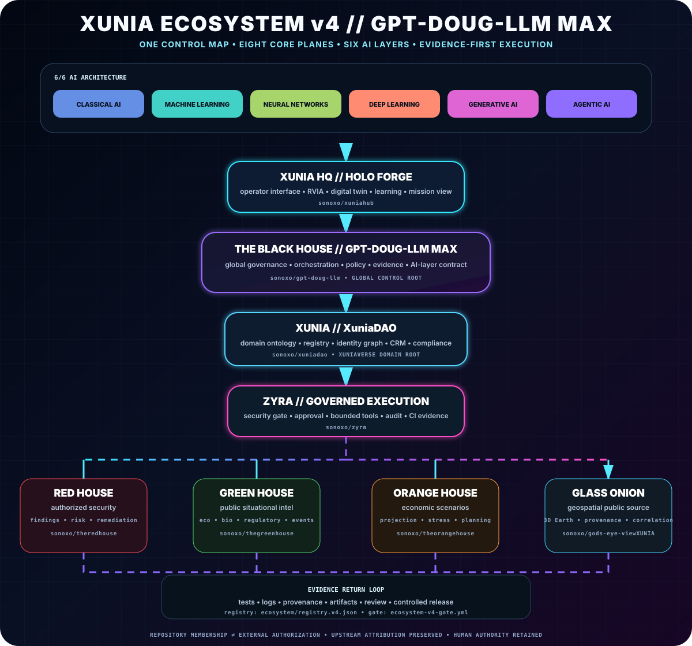
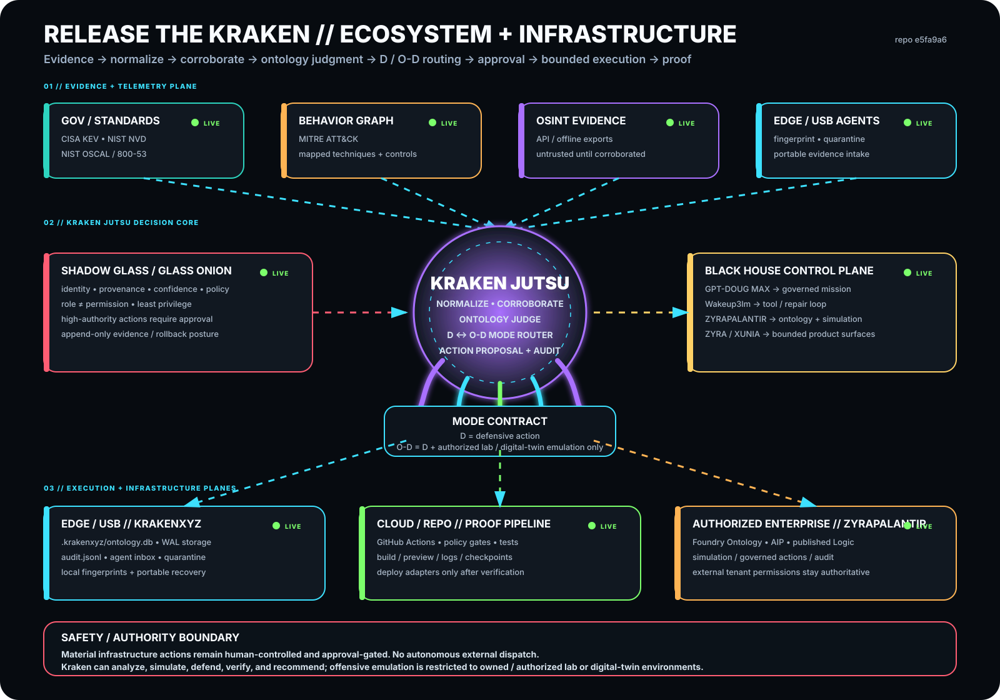
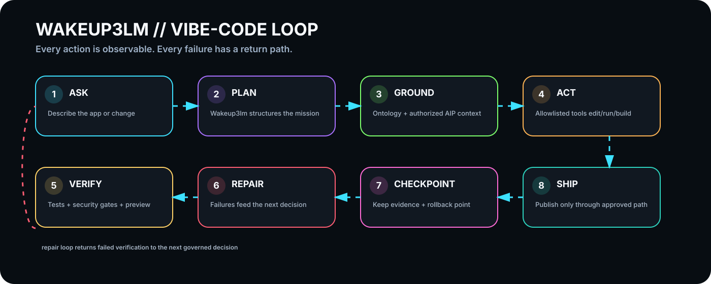
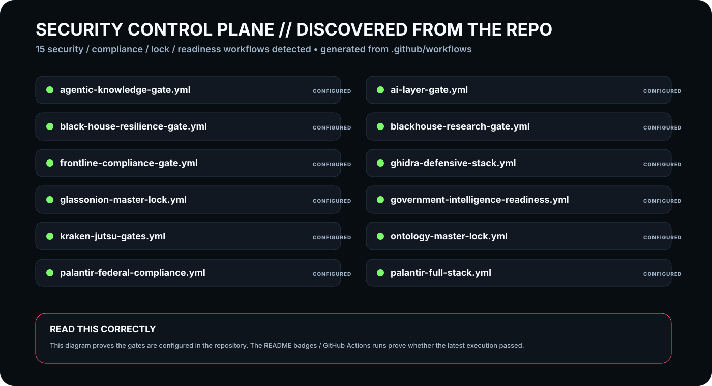
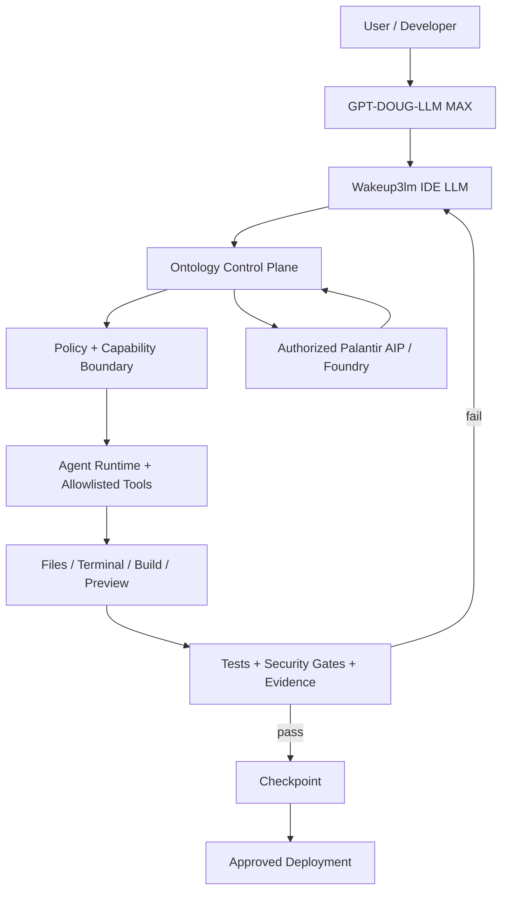

<div align="center">



# THE BLACK HOUSE // GPT-DOUG-LLM MAX

### ZYRA · Wakeup3lm · Ontology · Palantir AIP/Foundry · governed agentic infrastructure

**Build with AI. Keep execution visible. Keep authority explicit.**

[](https://github.com/sonoxo/gpt-doug-llm/actions/workflows/security-gate.yml)
[](https://github.com/sonoxo/gpt-doug-llm/actions/workflows/palantir-full-stack.yml)
[](https://github.com/sonoxo/gpt-doug-llm/actions/workflows/palantir-federal-compliance.yml)
[](https://github.com/sonoxo/gpt-doug-llm/actions/workflows/wakeup3lm.yml)
[](https://github.com/sonoxo/gpt-doug-llm/actions/workflows/ecosystem-readme-refresh.yml)
[](https://github.com/sonoxo/gpt-doug-llm/actions/workflows/unified-tests.yml)
[](LICENSE)

[Ecosystem](#ecosystem-at-a-glance) · [Vibe-code loop](#how-wakeup3lm-builds-an-app) · [Security](#security-control-plane) · [Products](#products) · [Architecture](#architecture) · [Palantir](#palantir-foundry--aip-integration) · [Quick Start](#quick-start) · [Docs](#documentation)

</div>

---

## The product in one minute

**GPT-DOUG-LLM MAX** is the orchestration layer. **Wakeup3lm** is the IDE-native LLM execution kernel. **The Ontology** gives the system typed operational context. **ZYRA** provides bounded agentic execution. **SHADOW GLASS / GLASS ONION** provide policy, provenance, and defensive controls. Authorized **Palantir AIP / Foundry** connections can supply model, Logic, and Ontology context while the external tenant remains authoritative.

The execution contract is deliberately simple:

> **AI proposes → Ontology grounds → policy bounds → approved tools execute → tests and probes produce proof → humans retain control of material actions.**

This repository is designed to make that entire path visible instead of hiding execution behind a chat response.

---

## Ecosystem at a glance

<div align="center">



</div>

### Read the diagram left-to-right, then down

| Layer | Beginner translation | What it owns |
| --- | --- | --- |
| **GPT-DOUG-LLM MAX** | The coordinator | Breaks the goal into a governed engineering mission |
| **Wakeup3lm** | The coding brain inside the IDE | Structured decisions, file/tool operations, repair loops, audit state |
| **Ontology** | The system's shared map of reality | Projects, files, decisions, tool calls, builds, previews, checkpoints, deployments |
| **Palantir AIP / Foundry** | Optional authorized enterprise intelligence plane | Model proxy, published Logic/functions, Foundry Ontology objects/actions |
| **Agent + tools** | The hands | Read/edit files, run commands, build, test, inspect, validate |
| **Security gates** | The guard rails around execution | Least privilege, approval gates, fail-closed checks, CI, compliance mappings |
| **Evidence** | Proof that the change works | Tests, logs, previews, probes, audit records |
| **Ship** | Controlled release | Checkpoint, deployment adapter, rollback path |

**The important idea:** the model never becomes authority simply because it generated an answer. State is grounded, actions are explicit, and results have to survive verification.

---

## How Wakeup3lm builds an app

<div align="center">



</div>

For a beginner, one prompt such as **“build me a responsive mobile web app”** becomes this engineering loop:

```text
ASK
 ↓
PLAN
 ↓
GROUND IN ONTOLOGY / AUTHORIZED CONTEXT
 ↓
EDIT + RUN + BUILD
 ↓
TEST + SECURITY + PREVIEW
 ↓
PASS? ── yes ──→ CHECKPOINT → SHIP
  │
  no
  ↓
DIAGNOSE → REPAIR → VERIFY AGAIN
```

Wakeup3lm records structured `AgentDecision` and `ToolCall` state so malformed model output becomes a governed failure that can be repaired instead of crashing the IDE.

Deep dive: [Wakeup3lm README](wakeup3lm/README.md) · [Wakeup3lm Ontology](wakeup3lm/ontology.py) · [Palantir Full Stack](docs/PALANTIR_FULL_STACK.md)

---

## Security control plane

<div align="center">



</div>

The infographic is **generated from the repository itself**. `scripts/generate_ecosystem_diagrams.py` scans the live codebase, Ontology, tests, and `.github/workflows/` definitions. The `Ecosystem README Refresh` workflow regenerates the SVGs after repository changes, so the diagrams are not intended to become a manually maintained architecture snapshot.

A green GitHub badge means the corresponding workflow passed its latest applicable run. The diagram itself means the gate is configured; it does not fabricate a passing result.

Security design rules:

- least privilege and explicit capability boundaries;
- path and host boundary enforcement;
- writes disabled or human-gated where consequences are material;
- malformed or unknown agent actions fail closed;
- tests, audits, and probes are evidence, not decoration;
- no repository setting can manufacture external Palantir entitlement or government authorization.

Read [SECURITY.md](SECURITY.md), [Federal / IC alignment](docs/FEDERAL_IC_ALIGNMENT.md), and [Palantir Full Stack](docs/PALANTIR_FULL_STACK.md).

---

## ◼️ SHADOW GLASS // Federal Mission Nexus

<div align="center">


[](safety-shield/SHADOW_GLASS.md)
[](safety-shield/ontology/safety-shield.ttl)
[](safety-shield/SHADOW_GLASS.md)
[](safety-shield/SHADOW_GLASS.md)
[](safety-shield/SHADOW_GLASS.md)

**SHADOW GLASS shields GLASS ONION. GLASS ONION makes authority observable.**

</div>

```text
PUBLIC / AUTHORIZED SOURCES
            ↓
      SHADOW GLASS
 identity • provenance • confidence • policy
            ↓
       GLASS ONION
 intent • context • execution • evidence
            ↓
  PALANTIR-STYLE ONTOLOGY
            ↓
     THE BLACK HOUSE
            ↓
GPT-DOUG-MAX → WAKEUP3LM → ZYRA / XUNIA
```

Public U.S. Space Force mission concepts, NSA defensive cybersecurity guidance, NASA public mission data/software, NIST controls, and public IC directives can be mapped into the project's provenance-first control model. **These are independent software mappings, not agency credentials or endorsements.**

[Open SHADOW GLASS →](safety-shield/SHADOW_GLASS.md) · [Machine-readable ontology →](safety-shield/ontology/shadow-glass-palantir.json)

---

## Products

| Product | What it does | Best fit | Readiness |
| --- | --- | --- | --- |
| **Wakeup3lm** | Ontology-first IDE LLM kernel with structured agent decisions, secure workspace tools, persistence, and audit state | AI-native browser IDE / vibe coding | **Implemented kernel** |
| **ZYRA Core** | Bounded agentic software-engineering runtime with planning, repository edits, checkpoints, validation, rollback, self-heal, and defensive policy controls | Developers and technical teams building agentic workflows | **Implemented runtime** |
| **GPT-DOUG ↔ Palantir Full Stack** | Foundry Ontology, AIP proxy/Logic, eval runner, Automate effects, Gotham adapter, Apollo adapter, and tenant probes | Authorized Palantir deployments | **Integration-ready** |
| **NXYZ Mouse Mic** | Voice/keyboard browser guidance that finds, highlights, and activates visible Foundry controls with high-impact confirmation | Accessibility, operator assistance, dense enterprise UI navigation | **v1.0.2 shipping candidate** |
| **Watch Dog** | Local dog detection + temporal scoring + alerting for suspected bathroom events | Edge-AI / smart-camera experimentation | **Experimental prototype** |

**Full portfolio:** [docs/PRODUCTS.md](docs/PRODUCTS.md)

---

## Why this architecture

Most AI tooling optimizes for generating an answer. This ecosystem focuses on the harder step: **turning a model recommendation into a controlled operation with evidence.**

| Value | Approach |
| --- | --- |
| **Execution control** | Deterministic policy and allowlisted tools sit between model output and mutation |
| **Recoverability** | Checkpoint before mission-owned writes; rollback when final validation fails |
| **Operational evidence** | Tests, logs, previews, reports, and runtime state are treated as proof |
| **Ontology grounding** | Operational nouns become typed objects and governed verbs become explicit actions/tool calls |
| **Enterprise context** | Foundry integration retrieves only context exposed to the configured authorized identity |
| **Local-first options** | Provider-neutral runtime paths reduce dependence on one hosted model vendor |
| **Human authority** | Material external writes remain gated rather than silently delegated to the model |

---

## Architecture



**Design rule:** reasoning is flexible; execution authority is explicit; evidence determines whether the result survives.

Deep dive: [docs/ARCHITECTURE.md](docs/ARCHITECTURE.md) · [docs/AGENTIC_RUNTIME.md](docs/AGENTIC_RUNTIME.md)

---

## Palantir Foundry + AIP integration

The repository contains software adapters for an **authorized Palantir enrollment**.

Implemented code planes include:

- Foundry OAuth/bearer configuration and exact-host HTTPS transport boundaries;
- Ontology listing, object types, object reads/searches, Query/Logic execution, and gated Actions;
- AIP provider-compatible model proxy invocation;
- published AIP Logic/function invocation;
- external regression eval runner against published Logic targets;
- Automate-compatible Action / Logic effect bridge;
- Gotham REST adapter;
- Apollo GraphQL adapter and explicitly approved Product Release publishing path;
- live tenant/resource probes;
- Wakeup3lm audit recording around external AIP/Logic operations.

```text
/palantir stack
/palantir probe
/palantir probe-model
/palantir query-types <ontology>
/palantir aip-logic <ontology> <query_api_name> <parameters_json>
/palantir aip-chat <model_rid> <prompt>
```

The repository does **not** manufacture credentials, licenses, tenant permissions, ATOs, clearances, or agency affiliation. External authorization remains authoritative.

Integration guides: [Palantir Foundry](docs/PALANTIR_FOUNDRY.md) · [Palantir Full Stack](docs/PALANTIR_FULL_STACK.md)

---

## Quick Start

```bash
git clone https://github.com/sonoxo/gpt-doug-llm.git
cd gpt-doug-llm
python3 dougctl.py heal
python3 zyra_chat.py
```

Verify the native runtime:

```text
/status
/agent-test
/laser-test
```

Typical mission:

```text
/plan add structured mission telemetry
/do add structured mission telemetry
/mission-status
```

Mission lifecycle:

```text
OBSERVE → PLAN → GROUND → EDIT → TEST → REVIEW → KEEP / REPAIR / ROLLBACK
```

Full command reference: [docs/COMMANDS.md](docs/COMMANDS.md)

---

## Trust and control

Built-in boundaries include repository-scoped agent tools, mission budgets, checkpoint-before-write behavior, validation gates, rollback, defensive circuit breakers, explicit Foundry write enablement, human confirmation for configured material actions, secret-aware configuration, and rejection of unrestricted external offensive behavior.

Read [SECURITY.md](SECURITY.md) and [docs/SECURE_DEVELOPMENT_BASELINE.md](docs/SECURE_DEVELOPMENT_BASELINE.md).

---

## Product readiness

| Label | Meaning |
| --- | --- |
| **Implemented kernel/runtime** | Code exists and is covered by its repository test/CI contract |
| **Shipping candidate** | Product package/specs exist and are being prepared for external distribution |
| **Integration-ready** | Connector/runtime exists but requires external tenant authorization/configuration |
| **Experimental prototype** | R&D code; not represented as production-grade assurance |
| **Planned** | Architecture or roadmap item; do not treat it as currently deployed |

A code-side ✅ and a live-tenant ✅ are deliberately different concepts.

---

## Repository map

```text
gpt-doug-llm/
├── wakeup3lm/                   # IDE LLM + local Ontology kernel
├── zyra_chat.py                 # Interactive ZYRA runtime
├── zyra_agent.py                # Bounded repository Agent Core
├── zyra_laser.py                # Defensive circuit breaker
├── palantir_foundry.py          # Hardened Foundry REST client
├── palantir_stack.py            # Palantir capability/control registry
├── federal_compliance.py        # Public federal/IC alignment gate
├── agents/                      # Planner / executor / reviewer components
├── workers/                     # Worker and orchestration services
├── tools/nxyz-mouse-mic/        # Browser-guidance product
├── safety-shield/               # SHADOW GLASS + GLASS ONION control plane
├── scripts/generate_ecosystem_diagrams.py
├── docs/assets/                 # Auto-generated responsive SVG infographics
├── tests/                       # Regression tests
└── .github/workflows/           # CI / security / release / adaptive-doc automation
```

---

## Documentation

| Start here | Purpose |
| --- | --- |
| [Wakeup3lm](wakeup3lm/README.md) | IDE-LLM kernel and Ontology-first execution model |
| [Palantir Full Stack](docs/PALANTIR_FULL_STACK.md) | AIP, Logic, Foundry, Gotham, Apollo and tenant verification |
| [Federal / IC Alignment](docs/FEDERAL_IC_ALIGNMENT.md) | Public control alignment and explicit authorization boundaries |
| [SHADOW GLASS](safety-shield/SHADOW_GLASS.md) | Defensive mission nexus and Glass Onion shield |
| [Product Portfolio](docs/PRODUCTS.md) | Products, buyer value, and readiness |
| [Architecture](docs/ARCHITECTURE.md) | Runtime layers and trust boundaries |
| [Agentic Runtime](docs/AGENTIC_RUNTIME.md) | Mission budgets, tools, checkpointing, rollback |
| [Commands](docs/COMMANDS.md) | Terminal command reference |
| [Security](SECURITY.md) | Security limitations and vulnerability reporting |
| [Contributing](CONTRIBUTING.md) | Development workflow |

---

## Independence statement

**ZYRA, GPT-DOUG-LLM, Wakeup3lm, NXYZ, SHADOW GLASS, GLASS ONION, The Black House, and repository-issued RVIA materials are independent software/project artifacts.** References to Palantir, the U.S. Space Force, NSA, NASA, government systems, intelligence/security disciplines, or external organizations describe integrations, public mission/reference mappings, research, interoperability goals, or design context. They do **not** imply federal-agency status, congressional authority, security clearance, certification, endorsement, contract award, or affiliation.

---

## License

MIT — see [LICENSE](LICENSE).

<div align="center">

### THE BLACK HOUSE // GPT-DOUG-LLM MAX

**Prompt → Ontology → governed action → evidence → ship.**

</div>
