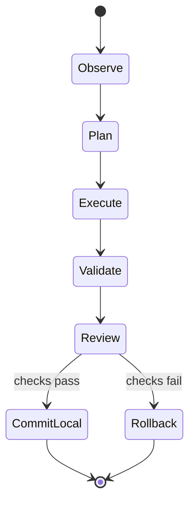

# ZYRA Architecture

ZYRA is a local-first agentic runtime built around a separation between **probabilistic reasoning** and **deterministic execution controls**.

## Design goals

1. Keep model choice replaceable.
2. Keep execution capabilities explicit and reviewable.
3. Bound autonomous work by time, steps, model calls, filesystem scope, and tool allowlists.
4. Preserve recoverability with checkpoints and rollback.
5. Treat defensive policy decisions as deterministic runtime code rather than model suggestions.
6. Keep external side effects behind explicit human-controlled boundaries.

## Runtime layers

```text
┌──────────────────────────────────────────────────────────────┐
│ USER SURFACES                                                │
│ ZYRA terminal · local web UI · control CLI                  │
└──────────────────────────────┬───────────────────────────────┘
                               │
┌──────────────────────────────▼───────────────────────────────┐
│ POLICY / DEFENSE                                             │
│ zyra.py · Native LASER · compliance/security normalization   │
└──────────────────────────────┬───────────────────────────────┘
                               │ allowed
┌──────────────────────────────▼───────────────────────────────┐
│ AGENTIC RUNTIME                                              │
│ planner · Agent Core · executor · reviewer · mission state   │
└───────────────┬──────────────────────────────┬───────────────┘
                │                              │
┌───────────────▼──────────────┐   ┌──────────▼───────────────┐
│ REPOSITORY TOOLS            │   │ MODEL BACKEND            │
│ read/search/edit/checkpoint  │   │ Ollama / provider layer  │
│ validation/rollback          │   │ local-first              │
└───────────────┬──────────────┘   └──────────┬───────────────┘
                │                              │
┌───────────────▼──────────────────────────────▼───────────────┐
│ ENGINEERING EVIDENCE                                         │
│ tests · security gate · dependency audit · SBOM · reports    │
└──────────────────────────────────────────────────────────────┘
```

## Canonical six-layer AI capability stack

The ecosystem must retain explicit coverage for all six conceptual AI layers below. A layer can be **repo-native** or delivered through a deliberately integrated model/runtime backend. This is an architectural coverage model, not a claim that every named algorithm is reimplemented from scratch in this repository.

| Layer | Required capabilities | Current ecosystem mapping |
| --- | --- | --- |
| **Classical AI** | symbolic AI, expert/rule systems, knowledge representation, logic/reasoning | `ontology.py`, `agents/ontology.py`, deterministic policy and ontology workers |
| **Machine Learning** | supervised/unsupervised learning interfaces, classification, regression/scoring, reinforcement-learning experimentation | local inference/application projects such as Watch Dog plus benchmark/reference hooks |
| **Neural Networks** | perceptron/MLP concepts, activation functions, hidden layers, backpropagation-trained model consumption | neural-model backends used by local vision and browser/model runtimes |
| **Deep Learning** | transformers, CNN-style vision, sequence/deep representation models, autoencoder/diffusion families | Transformers.js integration, COCO-SSD vision inference, Wan2.2/MLX diffusion paths |
| **Generative AI** | LLMs, diffusion generation, multimodal integration, replaceable generative providers | Wakeup3lm / model-provider layer and Free Video Studio generation stack |
| **Agentic AI** | memory/state, planning, tool use, bounded autonomous execution, verification/repair | planner, Agent Core, executor, reviewer, mission state, tools, checkpoints and repair loops |

The machine-readable source of truth is [`config/ai-layer-manifest.json`](../config/ai-layer-manifest.json). CI runs [`scripts/validate_ai_layers.py`](../scripts/validate_ai_layers.py) to prevent a canonical layer from disappearing or losing all repository evidence.

Conceptually the stack composes upward:

```text
AGENTIC AI
  memory · planning · tools · bounded execution
        ↑
GENERATIVE AI
  LLMs · diffusion · multimodal generation
        ↑
DEEP LEARNING
  transformers · CNNs · deep sequence/representation models
        ↑
NEURAL NETWORKS
  activations · hidden layers · learned weights
        ↑
MACHINE LEARNING
  classification · regression · supervised/unsupervised/RL methods
        ↑
CLASSICAL AI
  symbolic reasoning · expert systems · knowledge representation · logic
```

## Core components

### `zyra_chat.py`
Interactive terminal entrypoint. It loads repaired runtime settings, checks the local model backend, displays ZYRA status, routes slash commands, performs policy inspection, and streams local model output.

### `zyra_agent.py`
Bounded autonomous coding core. A mission receives a goal and a fixed budget. The agent can use a limited set of repository tools, checkpoint files before modification, validate changes, and roll back mission-owned edits after failure.

### `zyra_laser.py`
Local defensive circuit breaker. LASER does not attack or retaliate. It observes deterministic policy verdicts and can isolate ZYRA's own model-processing path after repeated blocked inputs or a blocked model output.

### `zyra_self_heal.py`
Repairs local runtime wiring such as provider aliases, Ollama reachability, and model selection. It runs bounded repair passes and persists only allowlisted non-secret runtime configuration.

### `agents/`
Planner, executor, reviewer, provider adapters, ontology/task schemas, and related orchestration code.

### `workers/`
Background worker and queue-oriented services. These are separate from the interactive ZYRA agent mission loop.

## Mission lifecycle



A mission's "commit" in this diagram means **keep the local checkpointed edits**. The Agent Core does not automatically push to GitHub or deploy external infrastructure.

## Trust boundaries

### Boundary A — User input → policy layer
All interactive requests pass through deterministic policy inspection before reaching the model path.

### Boundary B — Model reasoning → execution tools
The model does not receive direct unrestricted shell access. Tool requests are validated against the Agent Core's explicit capability surface.

### Boundary C — Repository → host filesystem
Agent path resolution is constrained to the repository. Escape attempts are rejected.

### Boundary D — Autonomous local change → external side effect
Push, deploy, send, and arbitrary external targeting are not Agent Core tools. External actions require a separate, explicit integration path.

## Failure behavior

ZYRA is designed to fail closed around autonomous writes:

- invalid tool request → reject;
- path escapes repository → reject;
- budget exhausted → stop mission;
- validation gate fails → rollback mission-owned edits;
- model backend failure → one bounded self-heal attempt, then stop cleanly;
- repeated blocked policy events → LASER isolates the local model path.

## Evidence and CI

GitHub workflows provide a second engineering boundary independent of the local model session. The security gate includes native Agent Core and LASER tests plus lint, static security analysis, dependency auditing, and SBOM generation.

The **AI Layer Gate** separately verifies that Classical AI, Machine Learning, Neural Networks, Deep Learning, Generative AI, and Agentic AI remain explicitly represented in the architecture manifest and retain repository evidence paths.

## Architectural principle

> Flexible reasoning should sit behind strict capabilities, observable state, and reversible execution.
