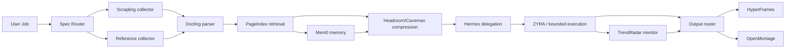

# GPT-Doug Hivemind Agent Stack

## Mission

Turn the public 15-project agent stack into a replaceable, bounded control plane rather than a monolith.

```text
define -> collect -> parse -> retrieve -> remember -> compress -> execute -> watch -> ship
```

The control plane is deliberately **dry-run by default**. Runtime mutations require both:

1. a registered adapter handler, and
2. `GPT_DOUG_HIVEMIND_EXECUTE=1`.

That keeps external tools subordinate to the existing GPT-Doug/ZYRA execution boundary.

## Layer map

| Layer | Primary projects | Role in the hive |
| --- | --- | --- |
| Define | OpenSpec, Spec Kit, Fabric | Convert intent into explicit specs, workflows, patterns, and acceptance criteria |
| Collect | Scrapling | Crawl authorized public sources and preserve source metadata |
| Parse | Docling | Normalize PDFs, office documents, HTML, media, images, tables, and formulas |
| Retrieve | PageIndex | Reason over hierarchical document indexes with traceable retrieval |
| Remember | Mem0 | Persistent user/session/agent memory with namespace isolation |
| Compress | Headroom, Caveman | Reduce context/tool-output size without throwing away execution-critical detail |
| Execute | Hermes Agent; Daytona legacy adapter | Delegate bounded work to subagents and approved sandboxes |
| Watch | TrendRadar | Track configured news/RSS/MCP sources and surface meaningful changes |
| Ship | HyperFrames, OpenMontage | Deterministic HTML/video rendering and agentic media production |
| Reference | AI Engineering Hub | Example corpus for implementation patterns, RAG, MCP, agents, evaluation, and production systems |

## Daytona status

The public `daytonaio/daytona` repository states that it is no longer maintained and that core development moved to a private codebase in June 2026. The hive therefore treats Daytona as a **legacy optional adapter**, not a mandatory execution dependency.

## Architecture



## Swarm behavior

The DAG supports parallel evidence collection and then converges at parsing. More independent collectors can be added without changing the downstream contract. `max_workers` is bounded to 32 in the core; runtime-specific schedulers may impose tighter limits.

## Integration policy

- Do not vendor all upstream repositories into GPT-Doug.
- Prefer CLI, Python, MCP, HTTP, or subprocess adapters with pinned versions.
- Keep source attribution and upstream licenses intact.
- Never treat a successful model response as proof of execution.
- Write evidence from tests, probes, renders, or tool results back to the GPT-Doug ontology/evidence layer.
- Preserve a dry-run path for every external mutation.

## CLI

```bash
python -m hivemind.cli doctor
python -m hivemind.cli plan "build a research-backed AI product brief"
python -m hivemind.cli run "build a research-backed AI product brief"

# Only after concrete mutation handlers are registered:
GPT_DOUG_HIVEMIND_EXECUTE=1 python -m hivemind.cli run "..." --execute
```
