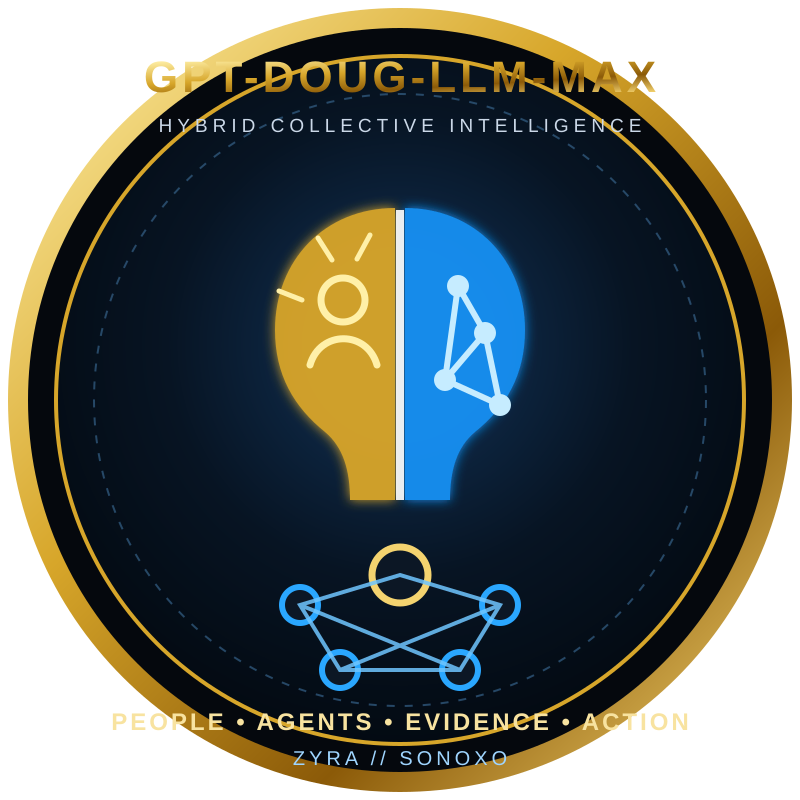
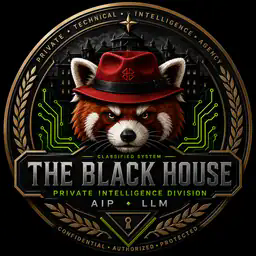
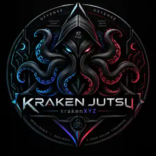
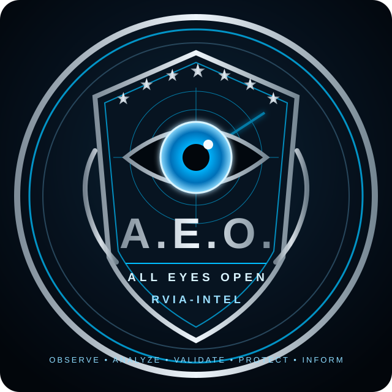

# Ecosystem Insignias

These are project insignias for the Sonoxo / GPT-Doug ecosystem. They are not government credentials, seals, endorsements, or claims of agency affiliation.

<table>
<tr>
<td align="center">
 
<strong><a href="../">GPT-DOUG-LLM-MAX</a></strong> 
Hybrid collective intelligence · people + agents + evidence + governed action
</td>
<td align="center">
 
<strong><a href="../the-black-house">THE BLACK HOUSE</a></strong> 
Governance · ontology · mission root
</td>
<td align="center">
 
<strong><a href="../kraken_jutsu">KRAKEN JUTSU</a></strong> 
Provenance-first judgment · defensive orchestration
</td>
</tr>
<tr>
<td align="center">
 
<strong><a href="https://github.com/sonoxo/zyra">ZYRA</a></strong> 
Bounded agentic execution
</td>
<td align="center">
 
<strong><a href="../rvia-intel/aeo">A.E.O. // RVIA-INTEL</a></strong> 
All Eyes Open · provenance-first intelligence accountability
</td>
<td align="center">
 
<strong>NORTH STAR</strong> 
Ontology + heterogeneous agent swarm + humans + evidence + dissent + simulation + consensus + policy + outcomes
</td>
</tr>
</table>

## GPT-Doug-LLM-Max identity

**Motto:** `PEOPLE • AGENTS • EVIDENCE • ACTION`

**Role:** Collective supervisor and evidence-grounded orchestration layer for the GPT-Doug ecosystem.

**Design language:** black / gold / electric blue; human intelligence on one side, machine intelligence on the other, joined through an ontology/evidence graph and bounded by ZYRA governance.

**Canonical asset:** [`docs/assets/insignia-gpt-doug-llm-max.svg`](assets/insignia-gpt-doug-llm-max.svg)
