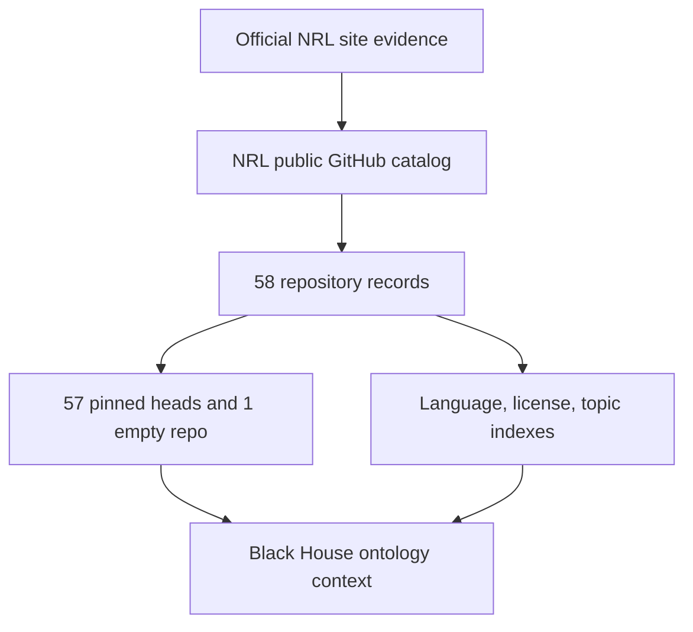

# NRL Public Repository Ecosystem

This Black House plane registers the complete public GitHub catalog observed for `USNavalResearchLaboratory` at `2026-09-07T22:24:49Z`.

| Pinned fact | Count |
| --- | ---: |
| Public repositories | 58 |
| Source repositories | 57 |
| Organization-owned forks | 1 |
| Default-branch commit heads | 57 |
| Empty repositories | 1 |
| Archived repositories | 0 |

The GitHub organization profile identifies the U.S. Naval Research Laboratory and publishes `nrl.navy.mil` contact details. Because the profile does not display the GitHub verified badge used by the archived `deptofdefense` organization, the integration uses the narrower identity state `OFFICIAL_SITE_CORROBORATED`. Official U.S. Navy NRL pages for SDT and MGEN link their GitHub source, providing primary-site corroboration.

That source identity does not transfer to GPT-DOUG or The Black House. Both remain independent and unaffiliated.

## Ontology materialization

The source manifest materializes typed objects for the organization, repositories, pinned commits, upstream repositories, primary languages, declared licenses, GitHub topics, evidence, and review proposals. GitHub descriptions and topics remain source-supplied metadata, not independent capability or safety judgments.



## Hard boundary

Catalog inclusion does not authorize cloning, dependency installation, source execution, deployment, security testing, real-world targeting, or weapons control. Reuse requires license review. Any semantic deep dive must name one repository, pin its source commit, pass safety and license review, and receive human approval.

## Files and validation

- `the-black-house/integrations/naval-research-laboratory/nrl-public-repository-ecosystem.json` — complete catalog and repository snapshot SHA-256.
- `foundry/ontology/nrl-public-repository-ontology.json` — object, link, materialization, query, action, and guardrail contract.
- `tools/validate_nrl_public_repository_ecosystem.py` — deterministic validator.
- `tests/test_nrl_public_repository_ecosystem.py` — fail-closed mutation tests.

```bash
python3 tools/validate_nrl_public_repository_ecosystem.py
python3 -m pytest -q tests/test_nrl_public_repository_ecosystem.py
python3 scripts/validate_black_house.py
```
