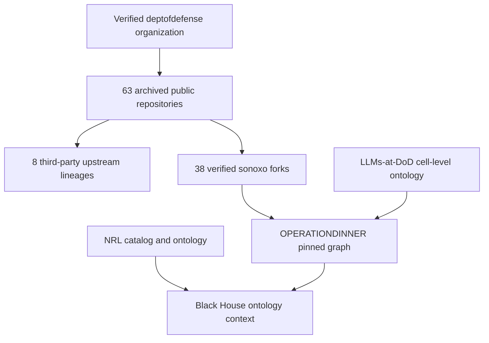

# OPERATIONDINNER

`OPERATIONDINNER` is a bounded Black House integration of public GitHub fork lineage. It inventories the current `sonoxo/*` forks whose verified direct parent belongs to `deptofdefense/*`, preserves any deeper upstream root, and binds the LLMs-at-DoD semantic ontology.

The operation also expands the ecosystem with a separate, complete public-repository catalog for `USNavalResearchLaboratory`. The NRL plane is metadata-grounded and requires per-repository review before deeper semantic ingestion.

Snapshot time: `2026-09-07T22:07:51Z`.

| Scope | Pinned count |
| --- | ---: |
| Public repositories in `deptofdefense` | 63 |
| `deptofdefense` repositories that are themselves forks | 8 |
| Verified direct `sonoxo` forks of `deptofdefense` repositories | 38 |
| Source repositories not present as verified `sonoxo` forks | 25 |
| Public NRL repositories | 58 |
| Pinned NRL heads | 57 |
| Empty NRL repositories | 1 |

The word “all” means all public relationships matching those rules at the snapshot time. This is not a crawl of every unrelated third-party fork in GitHub's global fork network, and it is not a live synchronization claim.

## Officiality boundary

GitHub marks `deptofdefense` as a verified organization controlling `dds.mil`. GitHub also marks the organization archived as of May 7, 2025. Repositories in that namespace are therefore represented as verified organization-hosted public sources, but archived status does not imply current support, safety, certification, or authorization.

The `sonoxo/*` repositories are independent forks. Fork lineage preserves provenance; it does not transfer DoD affiliation, endorsement, authority, access, or permission. Eight `deptofdefense/*` repositories are themselves forks, so their non-DoD upstream roots are also retained.



## Execution boundary

The integration reads metadata already pinned in the repository. It does not:

- clone or run source repositories;
- install their dependencies;
- read or store credentials or secrets;
- create, synchronize, modify, or delete GitHub forks;
- infer that archived code is safe or supported;
- grant operational or government authority.

The only non-read-only action is `proposeForkGraphRefresh`, which creates a local proposal and requires human review. Network egress and external mutation remain disabled by the manifest.

## Files

- `the-black-house/missions/operationdinner.json` — Black House mission envelope and audit result.
- `the-black-house/integrations/deptofdefense/operationdinner-fork-ecosystem.json` — complete pinned inventory, fork heads, direct parents, transitive roots, coverage gaps, actions, and guardrails.
- `foundry/ontology/llms-at-dod-ontology.json` — semantic deep dive for the first source repository, pinned to commit `fc90483ae3a2db48d46eb3231eccf691cec6d346`.
- `the-black-house/integrations/naval-research-laboratory/nrl-public-repository-ecosystem.json` — pinned catalog of all 58 observed public NRL repositories.
- `foundry/ontology/nrl-public-repository-ontology.json` — metadata materialization and per-repository review contract.
- `tools/validate_operationdinner.py` — deterministic integration validator.
- `tools/validate_llms_at_dod_ontology.py` — deterministic semantic-ontology validator.

## Verify

```bash
python3 tools/validate_llms_at_dod_ontology.py
python3 tools/validate_operationdinner.py
python3 tools/validate_nrl_public_repository_ecosystem.py
python3 scripts/validate_black_house.py
python3 -m pytest -q tests/test_llms_at_dod_ontology.py tests/test_operationdinner.py tests/test_nrl_public_repository_ecosystem.py
```

A future refresh must create a new reviewed snapshot. It must not silently rewrite the evidence used by this version.
