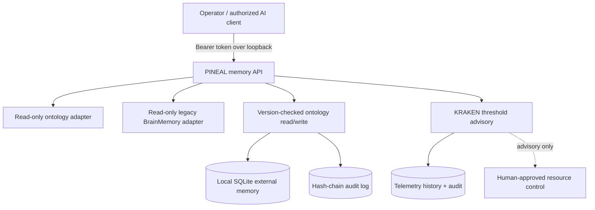

# GPT-DOUG-PINEAL

**Non-invasive, local-first read/write access to an AI system's external memory.**

PINEAL is a real, runnable Python memory gateway for GPT-Doug / SHAGGOTH-KRAKEN. It records typed ontology facts with provenance in SQLite, retrieves known context, bridges *read-only* to existing GPT-Doug ontology and `BrainMemory` exports, exposes an authenticated loopback JSON API, and simulates GPU power/thermal advisory decisions.

**Scope:** PINEAL reads and writes software memory controlled by the operator. It does not access hidden model weights, private chain-of-thought, EEG signals, or anyone's brain; it does not stimulate neural tissue or manipulate GPU/hydrogen hardware. It uses no paid model calls. A separate model integration would have its own costs.

## PINEAL live patent connectors (v0.4)

The previously disconnected metadata templates now have **explicit, permitted
network adapters**. No automatic network access occurs during `init`, `blink`,
`dashboard`, `patents sources`, `patents connect-status`, or offline search.
These are bibliographic records, **not validated scientific discoveries**.

| Source | Access mode | Publication scope | Required from operator |
| --- | --- | --- | --- |
| EPO Linked Open Data | Optional HTTPS known-ID GET | European EP documents | No key; EPO fair-use terms |
| **EPO OPS** | OAuth client credentials + bounded HTTPS XML | Worldwide publication IDs included in OPS | `EPO_OPS_KEY` and `EPO_OPS_SECRET` from an approved EPO app |
| **PatentsView Search API** | HTTPS with key header | Issued U.S. grants (`US...B1/B2`) | Existing `PATENTSVIEW_API_KEY`; new key issuance may be suspended |
| USPTO Open Data Portal | Authorized local export | USPTO data as available under your access | USPTO account/API access (direct publication lookup not implemented) |
| WIPO PATENTSCOPE | Authorized licensed local import | PCT records included in your lawful exports | Appropriate WIPO data agreement; **no scraping** |

After obtaining the required credentials directly from their official services,
provide them as environment variables on your own Mac. Do **not** paste keys
into GitHub commits or this conversation. Then run:

```bash
pineal patents connect-status                 # offline, credential presence only
pineal patents fetch US20260305554A1 --source epo-ops --online
pineal patents fetch US12345678B2 --source patentsview-us --online
pineal patents fetch EP0084638A1 --source epo-linked-open --online
pineal patents sync examples/patents/sample-publication-ids.txt --source epo-ops --dry-run
pineal patents sync examples/patents/sample-publication-ids.txt --source epo-ops --online
pineal patents search CH894993
pineal blink --watch
```

`patents sync` fetches up to 10 publication IDs by default (maximum 20 per
invocation, 4 KiB input), validates all records, then performs **one atomic
local import**. Dry-run sends no requests and writes no patents. Conflicting
local publication metadata aborts the whole batch. Published patent status,
kind codes, claim scope, legal status and scientific efficacy still require
independent verification. `patents connect-status` reports **configured**, not
**connected**; the CLI only reports a successful fetch after the API succeeds.
The local HTTP API remains read-only for patents and bearer-authenticated.

See [Patent API wiring and setup](docs/PATENT_CONNECTORS.md).

## PINEAL Cell Atlas // Patent Network // BLINK (v0.3)

This release adds a **10-type human cell reference ontology** and deterministic,
*symbolic* cell-state educational display, plus a **local worldwide patent-publication
metadata index**. It does not create real cells, decode a brain, or download the
world's patents. The optional EPO adapter makes **one known-publication metadata
request** only with `--online`. Other offices require your public or licensed exports.

```bash
pineal cells list
pineal cells simulate neuron --steps 6
pineal patents sources
pineal patents stats
pineal blink --watch --interval 0.7
# Optional, only with permission/online access to EPO:
pineal patents fetch EP0084638A1 --online
```

The terminal blink alternates a molecular **symbolic** cell illustration and
shows the local patent count, source status, and hash-chain audit verification.
The `pineal context QUERY` and `GET /v1/context?q=QUERY` retrieval paths now
include matching `patent_publications` and `cell_atlas` in addition to existing
ontology and memory sources, with provenance and scientific limitations.
`Ctrl+C` exits; this is not an independent background agent. The API adds
read-only `GET /v1/cells`, `GET /v1/patents?q=`, `GET /v1/patents/sources`
and `GET /v1/patents/stats`, all bearer-token protected.

Patent records are bibliographic disclosures, **not scientific validation**.
The project term "parthenogenesisitheorum" is treated as a conceptual research
label, **not** an established theorem or method. Human parthenogenesis is not
an established route to viable human reproduction, and human molecular biology
is not literally binary computer code. See
[Patents, sources and legal limitations](docs/PATENT_CONNECTORS.md) and
[research safety specification](docs/CELL_PATENT_NETWORK_SPEC.md).

## ZYRA Federation // Universal Terminal Cortex (offline first)

The federation update adds provider templates for **Meta, Tesla, X, Snapchat,
LinkedIn, Global Trade, Global Markets, Biotech Research, ZYRA, and Warfighter
Defensive Systems Integration**. Templates are **not connected accounts**.
All named companies, market data sources and defense systems remain unconnected;
this project does not claim access, endorsement or affiliation. The new dashboard
runs natively in macOS Terminal or iTerm without an account or external API key.

```bash
pineal federation
pineal dashboard --demo --watch --interval 1
```

This animates **synthetic demonstration data** with per-node mini graphs,
ontology topology, Kraken GPU advisories and a ZYRA policy/audit shield. It
makes no network calls and has no physical/neuronal control. Press `Ctrl+C`
to stop. For a real local view without simulated metrics:

```bash
pineal dashboard
pineal observe global-trade shipping_index 108.3 --unit index --source authorized-local-export
pineal dashboard
```

Warfighter readiness and EEG-inspired research values are limited to
explicitly labeled, nonpersonal simulation. The federation API is
`GET /v1/federation` behind the same bearer token as the memory endpoints.
See [architecture and boundaries](docs/FEDERATION_ARCHITECTURE.md).

### Install from the existing GPT-Doug GitHub integration branch

If `gpt-doug-pineal` is not present on your Mac, there is no directory to `cd` into.
Use this repo subdirectory installation instead:

```bash
python3 -m venv "$HOME/.venvs/gpt-doug-pineal"
source "$HOME/.venvs/gpt-doug-pineal/bin/activate"
python -m pip install 'git+https://github.com/sonoxo/gpt-doug-llm.git@feature/gpt-doug-pineal-mvp#subdirectory=integrations/gpt-doug-pineal'
pineal init
pineal dashboard --demo --watch
```

Python 3.10+ and Git are required. The standalone `sonoxo/gpt-doug-pineal`
repository has not been created. This verified branch is the actual source.

## Start in under a minute

Requirements: Python 3.10+; no cloud account, GPU, or API key required.

```bash
python3 -m venv .venv
. .venv/bin/activate
python -m pip install -e '.[test]'
pineal init
pineal put gpt-doug has_layer pineal --namespace architecture --source user-approved
pineal find pineal
pineal context pineal
pineal telemetry 83 350 --water-fraction 0.7
pineal audit
python -m pytest -q
```

Run the local API in one terminal:

```bash
pineal serve --port 8765
```

Read and write from another terminal (token is local and never stored in Git):

```bash
TOKEN="$(cat "$HOME/.local/share/gpt-doug-pineal/token")"
curl -fsS http://127.0.0.1:8765/v1/health -H "Authorization: Bearer $TOKEN"
curl -fsS http://127.0.0.1:8765/v1/memories \
  -H "Authorization: Bearer $TOKEN" \
  -H 'Content-Type: application/json' \
  -d '{"subject":"gpt-doug","predicate":"has_layer","value":"PINEAL","source":"operator-approved"}'
curl -fsS 'http://127.0.0.1:8765/v1/context?q=PINEAL' \
  -H "Authorization: Bearer $TOKEN"
```

The API supports `POST /v1/memories`, `GET /v1/memories?q=`, `GET /v1/memories/<id>`, `PUT /v1/memories/<id>` (include `expected_version`), `DELETE /v1/memories/<id>?expected_version=N`, `GET /v1/context?q=`, `POST /v1/telemetry`, `GET /v1/telemetry`, `POST /v1/heartbeat`, `GET /v1/audit/verify`, and `GET /v1/health`. **Every endpoint requires the bearer token.** Do not bind it to a public network or proxy it without TLS and access controls.

## Hook to the existing GPT-Doug brain

The read-only bridge consumes two concrete files from the current `sonoxo/gpt-doug-llm` implementation:

- `config/global-ontology.json` via `gpt_brain.ontology.OntologyIndex`'s data format;
- `~/.gpt-doug/brain-memory-v1.jsonl` via `gpt_brain.memory.BrainMemory`'s export format.

It does not modify those files. For a checked-out `gpt-doug-llm`:

```bash
export PINEAL_GPT_DOUG_ROOT="$HOME/code/gpt-doug-llm"  # change to actual checkout
export PINEAL_LEGACY_HOME="$HOME"
pineal context "gpt-doug memory"
```

Those environment variables also enable the optional bridge for `GET /v1/context` when `pineal serve` starts. Response order is **ontology, legacy memory, PINEAL-authorized edits**. Integration is deliberately read-only for the source repository so the existing ontology remains authoritative. PINEAL edits are separate until an operator implements a reviewed synchronization policy.

## Components



The external 'brain' is a data structure, not an anatomical organ or a private model state. See [Architecture](docs/ARCHITECTURE.md), [Patent mapping](docs/PATENT_MAPPING.md), and [Neural-interface boundaries](docs/NEURO_BOUNDARIES.md).

## Security and limits

Local database lives at `~/.local/share/gpt-doug-pineal/pineal.sqlite3` (or `PINEAL_HOME`). The generated bearer token is stored in `token`, created with restrictive file permissions. Credentials and secret-looking values are rejected from memory; treat stored data as sensitive regardless. Do not commit the database or token. HTTP listens on `127.0.0.1` only, requires authentication for reads as well as writes, does not enable cross-origin access, and limits JSON bodies to 32 KiB. Each write carries provenance and an actor, with optimistic locking for replacements/deletes. Audit entries omit plaintext but are not a substitute for tamper-resistant off-host log storage.

Neural sensing: any future wearable EEG adapter must be opt-in, read-only by default, privacy-preserving, and use documented device APIs. Decoding arbitrary thoughts or writing knowledge into a human brain is **not** a capability of this project.

## Run tests

```bash
python -m pytest -q
```

## Standalone GitHub repository

```bash
gh auth login
gh repo create sonoxo/gpt-doug-pineal --private --source . --remote origin --push
```

Run from the project directory after reviewing the code. The command requires a GitHub session with permission to create the repository; it does not run automatically and does not promise repo creation.

## Research provenance

User-supplied USPTO Patent Public Search excerpt: publication **US 2026/0313851 A1**, October 8, 2026, "System and Method for Providing Supplemental Power and Cooling to One or More Components of an Electrical Load," Wang et al., assigned to Toyota entities. It describes server power/cooling, not BCI. Here it inspires *advisory* telemetry monitoring, thresholds, and low-water safeguard review; no patent implementation, ownership, or license is claimed. See `docs/PATENT_MAPPING.md`.

MIT license. Experimental research and developer tooling; no medical claims.
