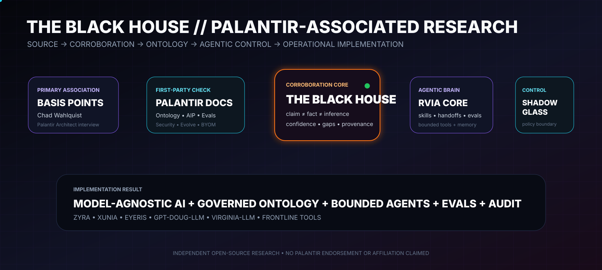

<div align="center">



# THE BLACK HOUSE // PALANTIR-ASSOCIATED INTELLIGENCE BRIEF

### `INSTITUTIONAL SOVEREIGNTY` · `ONTOLOGY` · `MODEL PORTABILITY` · `AGENTIC AI` · `FDE` · `EVALS`

**Assessment:** `HIGH CONFIDENCE / SOURCE-SEPARATED / PR-READY`

</div>

**Research date:** 2026-09-02  
**Primary source:** Basis Points interview — *Why Palantir Is Winning In The Era of Institutional Sovereignty ft. Chad Wahlquist*  
**Video:** https://www.youtube.com/watch?v=egr-UDWLZPI&t=2150s  
**Guest:** Chad Wahlquist — publicly presented by Palantir Technologies as an Architect  
**Project:** GPT-DOUG-LLM → RVIA → THE BLACK HOUSE

> **Independence statement:** This is independent, open-source research. It is not an official Palantir publication and does not imply endorsement, partnership, certification, customer status, contract, or affiliation.

---

## BLUF

The interview provides credible Palantir-associated evidence for an architecture thesis strongly corroborated by Palantir's current first-party documentation: **the durable enterprise advantage is not the LLM by itself; it is the institution's governed data, operational context, decision model, workflows, and ability to change models without surrendering control of those assets.**

For The Black House / RVIA, the most defensible implementation pattern is:

```text
INSTITUTIONAL DATA + PUBLIC/AUTHORIZED INTEL
                 ↓
            PROVENANCE
                 ↓
         GOVERNED ONTOLOGY
                 ↓
       MODEL-AGNOSTIC REASONING
                 ↓
          BOUNDED AGENT TOOLS
                 ↓
        POLICY + HUMAN AUTHORITY
                 ↓
       ACTION / AUTOMATION / APP
                 ↓
        EVALS + OBSERVABILITY
                 ↓
     EVIDENCE → MEMORY → IMPROVEMENT
```

This maps cleanly to Palantir's current documentation describing the Ontology as the operational/digital-twin layer connecting data, models, objects, relationships, actions, functions, and dynamic security; AIP Logic as an LLM-enabled workflow layer; AIP Evals as a production confidence mechanism; Automate as a governed trigger/effects layer; AIP Evolve as a fleet-based AI FDE improvement system; and AIP security as inheriting Foundry security controls.

---

## Source credibility

The video is a **Basis Points** interview, not a video published by Palantir's official YouTube channel. The Palantir association is nevertheless credible because:

1. the featured guest is Chad Wahlquist, publicly presented by Palantir Technologies as an Architect;
2. Palantir's own public architecture material features Wahlquist discussing AIP architecture;
3. Palantir-linked accounts amplified the Basis Points episode;
4. public episode summaries consistently frame the discussion around institutional sovereignty, Ontology, deployment, model choice, and institutional data/decision advantage;
5. the core technical themes are independently corroborated by current first-party Palantir documentation.

**Association confidence:** `HIGH`  
**Exact timestamp transcript confidence:** `MEDIUM` — the requested 2150s timestamp is preserved, but a reliable first-party caption payload for that exact segment was not independently recovered during this research pass.

---

# Extracted intelligence

## INTEL-01 — The model is a component; institutional context is the durable asset

**Assessment:** `HIGH CONFIDENCE`

The interview is repeatedly summarized around the idea that value comes from an institution's data, workflows, context, and decisions rather than exclusive allegiance to a particular frontier model. A widely circulated excerpt attributed to Wahlquist states, in part, **“It's your data. You own it.”** The episode framing connects that idea to the Ontology and institutional sovereignty.

Palantir's Ontology documentation independently describes the Ontology as the operational layer connecting real-world entities, data, models, links, actions, functions, and dynamic security. Its Architecture Center says the Ontology integrates enterprise data, logic, action, and security policies into a representation usable by both humans and AI agents.

### RVIA implementation

- keep source data and decision context under project-controlled provenance;
- treat models as replaceable reasoning engines behind a stable governed contract;
- never encode model-provider-specific assumptions into the intelligence ontology;
- preserve source lineage independently of model output;
- evaluate model substitutions against fixed eval suites.

---

## INTEL-02 — Ontology is a decision/action substrate, not just a schema

**Assessment:** `VERY HIGH CONFIDENCE`

Palantir's current documentation explicitly distinguishes semantic elements (`objects`, `properties`, `links`) from kinetic elements (`actions`, `functions`, `dynamic security`). This is materially different from treating an ontology as a passive graph or metadata catalog.

### RVIA implementation

Model both nouns and governed verbs.

**Nouns:**
- `Source`
- `Claim`
- `EvidenceArtifact`
- `AgencyReference`
- `Dataset`
- `SoftwareArtifact`
- `ModelCapability`
- `Agent`
- `IntelligenceBrief`
- `Decision`

**Verbs:**
- `ingestPublicSource`
- `validateProvenance`
- `corroborateClaim`
- `scoreConfidence`
- `requestModelAnalysis`
- `stageBrief`
- `approveRelease`
- `quarantineArtifact`
- `revokeTrust`

The result is a system where intelligence becomes operationally useful without making model output itself authoritative.

---

## INTEL-03 — Institutional sovereignty implies model portability and anti-lock-in design

**Assessment:** `VERY HIGH CONFIDENCE`

Palantir's current BYOM documentation supports customer-connected and self-hosted models, including self-hosted models for data-sovereignty use cases. August 2026 product announcements also show expanded open-weight model availability in AIP. AIP Evolve supports model migration and cost/latency optimization as explicit goals.

### RVIA implementation

Create a provider-neutral `ModelCapability` contract with:

- model/provider ID;
- deployment boundary;
- allowed data classes;
- retention/training terms;
- tool-use support;
- context/output limits;
- cost/latency metrics;
- eval suite score;
- approved mission lanes;
- rollback target.

**No provider receives permanent architectural privilege.**

---

## INTEL-04 — Agentic systems should evolve continuously under measurable constraints

**Assessment:** `VERY HIGH CONFIDENCE`

AIP Evolve currently coordinates fleets of AI FDE agents around a target, goal, validation strategy, operational limits, and proposal-for-review workflow. Palantir documents use cases including reducing AI cost/latency, improving evals, migrating models, and custom optimization goals.

### RVIA implementation

```text
TARGET WORKFLOW
   ↓
GOAL + LIMITS
   ↓
AGENT PROPOSES CHANGE
   ↓
ISOLATED TEST
   ↓
EVAL SUITE
   ↓
COMPARE BASELINE
   ↓
HUMAN / POLICY REVIEW
   ↓
MERGE OR REJECT
   ↓
AUDIT
```

Agents may improve systems; they may not self-grant new authority.

---

## INTEL-05 — Production value is the objective; AI research without deployment is incomplete

**Assessment:** `HIGH CONFIDENCE`

Palantir's own public architecture content featuring Wahlquist emphasizes production deployment and workflow orchestration. Current AIP Logic documentation is similarly oriented around critical tasks, Ontology edits, automation, testing, monitoring, and release.

### RVIA implementation

Every new agent/tool must define:

- operational user;
- mission problem;
- input/output;
- deterministic success test;
- human authority boundary;
- measurable deployment value;
- rollback path;
- audit evidence.

Research artifacts without a validated operational use remain `RESEARCH`, not `PRODUCTION`.

---

## INTEL-06 — FDE is a learning architecture, not merely a staffing model

**Assessment:** `VERY HIGH CONFIDENCE`

Palantir's Architecture Center describes Forward Deployed Engineering as a feedback mechanism in which engineers get close to real problems while core teams synthesize field feedback and ship platform improvements.

### RVIA implementation

```text
FRONTLINE USER
   ↓
OBSERVED WORKFLOW FAILURE / FRICTION
   ↓
THE BLACK HOUSE EVIDENCE RECORD
   ↓
AGENT / ENGINEER ANALYSIS
   ↓
PATCH / TOOL / ONTOLOGY CHANGE
   ↓
EVALS + SECURITY + COMPLIANCE
   ↓
RELEASE
   ↓
TELEMETRY + USER FEEDBACK
   ↺
```

This is how an open-source stack can compound operational knowledge without falsely claiming model-weight retraining.

---

## INTEL-07 — Reusable skills and context control are strategic agent infrastructure

**Assessment:** `VERY HIGH CONFIDENCE`

AIP Analyst supports reusable Skills, analysis lookup, context cleanup, tool management, provenance graphs, and export of analysis into reusable Skills.

### RVIA implementation

Treat agent knowledge as versioned skills with:

- minimal trigger description;
- full instructions loaded only when needed;
- version + owner;
- source references;
- allowed tools;
- data scope;
- expiry/review date;
- eval suite;
- provenance.

Do not stuff the entire knowledge base into every prompt.

---

## INTEL-08 — Observability must include cost, latency, attribution, and failure—not only logs

**Assessment:** `VERY HIGH CONFIDENCE`

Palantir's August 2026 object timeline and AIP observability features expose agent/human attribution, token usage, runtime, waiting time, agentic coverage, edits, and workflow failure rates.

### RVIA implementation

Extend GLASS ONION events with:

- `agent_id`
- `model_id`
- `tool_id`
- `source_refs`
- `input_classification`
- `token_or_compute_cost`
- `runtime_ms`
- `human_wait_ms`
- `policy_decision`
- `action_receipt`
- `validation_result`
- `failure_category`
- `rollback_status`

---

# What this means for GPT-DOUG-LLM / The Black House

```text
THE BLACK HOUSE
source truth + evidence + confidence
        ↓
RVIA AGENTIC CORE
skills + planning + handoffs + evals
        ↓
SHADOW GLASS
identity + provenance + data/model/tool authority
        ↓
GLASS ONION
intent + execution + attribution + evidence
        ↓
PALANTIR-STYLE ONTOLOGY
objects + links + actions + functions
        ↓
MODEL ROUTER
frontier / open-weight / private / local
        ↓
ZYRA / XUNIA / EYERIS / FRONTLINE TOOLS
        ↓
EVALS + TELEMETRY + HUMAN FEEDBACK
        ↺
```

## Recommended implementation priorities

1. **Model-agnostic routing** — choose models by mission/evals/security/cost, not brand loyalty.
2. **Ontology-as-operational-contract** — every consequential verb becomes a governed action/function.
3. **Skill registry** — reusable agent knowledge with provenance and evals.
4. **Agent evolution loop** — propose/test/evaluate/review/merge improvements.
5. **Full observability** — cost, latency, tool use, attribution, failures, evidence.
6. **Sovereign data boundary** — no external-model egress without explicit model/data authorization.
7. **SuperRepo-style full-stack discipline** — keep ontology, functions, application contracts, tests, and deployment metadata versioned together where practical.
8. **PR evidence gate** — no architecture claim merges without a primary source or clearly labeled inference.

---

# Confidence matrix

| Claim | Confidence | Basis |
| --- | --- | --- |
| Video is a Basis Points interview featuring Palantir Architect Chad Wahlquist | `HIGH` | Multiple independent indexed references + Palantir public attribution of role |
| Interview emphasizes institutional sovereignty and organizational data/decision advantage | `HIGH` | Repeated episode summaries and quoted excerpt |
| Exact wording at `t=2150s` | `MEDIUM` | Timestamp preserved; exact first-party captions not independently recovered |
| Ontology = operational/digital-twin layer with objects, links, actions, functions, security | `VERY HIGH` | Palantir first-party documentation |
| Palantir supports model choice/BYOM/open-weight patterns | `VERY HIGH` | Palantir first-party docs + August 2026 announcements |
| Palantir coordinates AI FDE agent fleets to optimize AI systems | `VERY HIGH` | AIP Evolve first-party documentation |
| Evals/observability are production-control primitives | `VERY HIGH` | AIP Evals + observability first-party documentation |
| RVIA implements Palantir proprietary internals | `NOT CLAIMED` | RVIA is independent and uses Palantir-style architectural patterns only |

---

# Required Palantir documentation

- Architecture Center — https://www.palantir.com/docs/foundry/architecture-center/overview
- Ontology overview — https://www.palantir.com/docs/foundry/ontology/overview
- Ontology core concepts — https://www.palantir.com/docs/foundry/ontology/core-concepts
- Object permissioning — https://www.palantir.com/docs/foundry/object-permissioning/overview
- AIP Logic — https://www.palantir.com/docs/foundry/logic
- AIP Evals — https://www.palantir.com/docs/foundry/aip-evals/overview
- Automate — https://www.palantir.com/docs/foundry/automate
- AIP Evolve — https://www.palantir.com/docs/foundry/aip-evolve/overview
- Bring Your Own Model — https://www.palantir.com/docs/foundry/aip/bring-your-own-model
- AIP security/privacy — https://www.palantir.com/docs/foundry/aip/aip-security
- AIP Analyst capabilities — https://www.palantir.com/docs/foundry/aip-analyst/capabilities
- SuperRepo overview — https://www.palantir.com/docs/foundry/superrepo/overview
- August 2026 announcements — https://www.palantir.com/docs/foundry/announcements

---

# Credits

- **Basis Points** — publisher/interviewer of the primary video source.
- **Chad Wahlquist** — interview guest; publicly presented by Palantir Technologies as an Architect.
- **Palantir Technologies** — primary technical documentation and public architecture references used for corroboration.
- **Palantir Developer Documentation** — Foundry/AIP/Ontology/Automate/Evals/Evolve/Security/SuperRepo references.
- **Open-source research project:** GPT-DOUG-LLM / RVIA / The Black House.

See [`../PALANTIR_RESEARCH_CREDITS.md`](../PALANTIR_RESEARCH_CREDITS.md) for source-by-source attribution and PR citation rules.

---

## Final assessment

**The evidence strongly supports the architecture direction already being built in RVIA:** preserve institutional data/control, make the ontology the operational contract, make models replaceable, give agents bounded tools rather than ambient authority, measure every workflow, and continuously improve through evidence-backed eval/review loops.

Our confidence is intentionally **evidence-backed rather than performative**: first-party Palantir documentation receives the highest weight; credible Palantir-associated interview evidence is retained with provenance; exact unverified transcript details remain explicitly marked as such.
