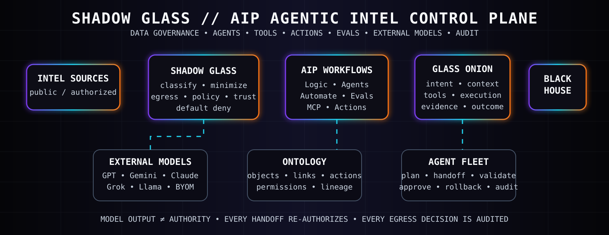

<div align="center">



# AIP AGENTIC WORKFLOWS // SHADOW GLASS

### `AIP LOGIC` · `CHATBOT / AGENT WORKFLOWS` · `AUTOMATE` · `EVALS` · `ONTOLOGY MCP` · `EXTERNAL MODEL GOVERNANCE`

**Every agent can reason. No agent gets ambient authority. Every model boundary is policy-gated.**

</div>

---

## 30-second explanation

This layer extends the RVIA / VIRGINIA-LLM stack with AIP-style agentic workflows.

```text
INTEL SOURCE
   ↓
SHADOW GLASS DATA GATE
   ↓
ONTOLOGY / RETRIEVAL
   ↓
PLAN → REASON → TOOL REQUEST
   ↓
GLASS ONION OBSERVABILITY
   ↓
APPROVAL / ACTION GATE
   ↓
EXECUTE → VALIDATE → EVAL
   ↓
MEMORY / HANDOFF / AUDIT
   ↓
THE BLACK HOUSE BRIEF
```

A model can recommend a tool call or action. The runtime decides whether that request is authorized, in scope, safe to execute, and allowed to receive the requested data.

---

## Full agentic workflow catalog

| Workflow | Purpose | Mandatory SHADOW GLASS controls |
| --- | --- | --- |
| **Ingest** | Accept public or otherwise authorized data | provenance, classification, source identity, malware/content checks |
| **Normalize** | Convert raw material into structured evidence | schema validation, immutable source reference, checksum |
| **Retrieve** | Query Ontology, documents, datasets, or tools | user/service identity, object/property permissions, purpose binding |
| **Plan** | Break a mission into bounded steps | mission budget, tool allowlist, no side effects |
| **Reason** | Use an LLM to analyze context | model registry, data egress policy, prompt minimization |
| **Tool request** | Agent asks to call a tool | tool scope, parameter validation, runtime authorization |
| **Action** | Write or change Ontology state | submission criteria, write authorization, approval when material |
| **Automation** | Trigger workflows from events | explicit trigger, bounded action set, staged writes for review where appropriate |
| **Human review** | Approve elevated-risk recommendations | named approver role, decision evidence, expiration |
| **Execution** | Perform the approved operation | least privilege, deterministic adapter, receipt/diff |
| **Validation** | Prove the operation succeeded | tests, schema checks, assertions, reconciliation |
| **Evaluation** | Measure LLM/workflow quality | test suites, model comparison, regression thresholds |
| **Memory** | Retain useful context | approved fields only, retention window, classification inheritance |
| **Handoff** | Transfer work to another agent/model | re-authorization, context minimization, trace linkage |
| **Rollback** | Reverse failed or rejected changes | checkpoint, reversible action contract, audit trail |
| **Quarantine** | Isolate suspect inputs/outputs | deny downstream use, preserve evidence |
| **Release** | Publish a brief/result | evidence threshold, confidence score, reviewer policy |
| **Audit** | Record who/what/why/how | append-only event, model/tool/version IDs, source lineage |

---

## AIP-aligned building blocks

### 1. AIP Logic pattern

Use composable blocks for data access, calculations, conditions, model calls, functions, loops, and actions.

```text
INPUT
  → QUERY OBJECTS
  → FILTER / CONDITION
  → USE LLM
  → VALIDATE OUTPUT
  → APPLY ACTION OR STAGE PROPOSAL
  → AUDIT
```

### 2. Chatbot / agent pattern

Agents receive only the tools and context required for the task.

```text
USER / MISSION
  → RETRIEVAL CONTEXT
  → APPLICATION STATE
  → LLM
  → TOOL REQUEST
       ├─ object query
       ├─ function
       └─ action
  → confirmation when required
```

### 3. Automate pattern

```text
ONTOLOGY EVENT
  → CONDITION
  → LOGIC FUNCTION
  → STAGED ACTION
  → HUMAN REVIEW OR AUTO-APPLY IF POLICY ALLOWS
  → EVIDENCE + AUDIT
```

### 4. Evals pattern

```text
TEST CASES
  → TARGET WORKFLOW / MODEL
  → EVALUATORS
  → METRICS
  → COMPARE MODELS / PROMPTS / VERSIONS
  → RELEASE GATE
```

### 5. Ontology MCP / external agent pattern

External agents may only see explicitly exposed Ontology resources and actions.

```text
EXTERNAL AGENT
  → OAuth / service identity
  → application restrictions
  → scoped Ontology resources
  → SHADOW GLASS external-model egress gate
  → permitted read/query/action only
```

---

# External-model data governance

## Default rule

> **DENY external model egress unless the provider, model, purpose, data class, and requested fields are all explicitly approved.**

The policy is provider-agnostic. A new model is not trusted because of its brand name or benchmark score.

### Model boundary classes

| Class | Example architecture | Default posture |
| --- | --- | --- |
| `AIP_MANAGED_THIRD_PARTY` | model accessed through a governed AIP model service | allow only under tenant/provider controls and data policy |
| `BYOM_REST` | organization-registered external REST model | deny until provider contract + endpoint + retention/training rules are registered |
| `EXTERNAL_MCP` | outside agent connected to Ontology MCP | deny sensitive egress; restrict resources/actions and OAuth scopes |
| `LOCAL_PRIVATE` | locally hosted or private-tenant model | still policy-gated; local does not mean automatically trusted |
| `UNKNOWN_EXTERNAL` | unregistered public endpoint/plugin/model | deny |

## Data classes

| Data class | External model posture |
| --- | --- |
| `PUBLIC` | may be eligible after provider/model registration |
| `INTERNAL` | only approved provider/model + no-training/retention requirements + minimization + audit |
| `CONTROLLED` | external egress denied by default; requires a separately authorized environment and policy exception |
| `RESTRICTED` | external egress denied |
| `SECRET_CREDENTIAL` | never place in model prompts |

This project is designed for public or otherwise lawfully authorized information. It does not create authority to process classified, export-controlled, privileged, or otherwise restricted data.

---

## SHADOW GLASS egress checklist

Before any outside model receives context, all checks must pass:

1. **Identity** — who initiated the request?
2. **Purpose** — what exact mission requires model access?
3. **Provider registry** — is the provider/model approved?
4. **Retention** — is prompt/completion retention acceptable and documented?
5. **Training** — is use for provider model training prohibited or explicitly acceptable?
6. **Region** — is the endpoint region permitted?
7. **Classification** — is the data class allowed for this model boundary?
8. **Minimization** — are only required fields included?
9. **Redaction** — secrets/PII/sensitive fields removed when policy requires it?
10. **Tool scope** — can the model only request allowed tools/actions?
11. **Human gate** — does this request require review?
12. **Audit** — request, model ID, policy decision, fields, and outcome recorded?

Policy source: [`policies/external-model-egress.rego`](./policies/external-model-egress.rego)

Registry schema: [`model-registry/external-model-registry.schema.json`](./model-registry/external-model-registry.schema.json)

---

## Intel workflow example

```text
1. NASA public dataset arrives
2. Ingest records source URL + checksum + retrieval time
3. SHADOW GLASS classifies it PUBLIC
4. Ontology maps Dataset → MissionDomain → EvidenceArtifact
5. Agent retrieves only mission-relevant fields
6. Model registry selects an approved model
7. External-model egress policy evaluates the exact prompt payload
8. LLM produces an assessment draft
9. GLASS ONION records context, model, tools, and decisions
10. AIP-style eval checks factual grounding / source citation / schema
11. Human review occurs if confidence or impact threshold requires it
12. The Black House publishes a brief with sources, confidence, and gaps
```

---

## Multi-agent handoff contract

Every handoff creates a new authorization decision.

```text
AGENT A
  → handoff manifest
     mission_id
     allowed purpose
     minimum context
     source references
     data classification
     permitted tools
     expiry
  → SHADOW GLASS re-check
  → AGENT B
```

No agent inherits unrestricted tool access, credentials, or hidden context from another agent.

---

## Release gates

A workflow cannot be labeled production-ready until it has:

- an explicit model/provider record;
- tool and action scopes;
- data classification and egress rules;
- negative tests for prohibited data disclosure;
- eval coverage for grounding and task quality;
- human-review rules for elevated-impact writes;
- rollback/recovery behavior;
- audit and lineage fields;
- a documented owner.

---

## Reference alignment

This architecture is informed by current public Palantir documentation for AIP Logic, AIP Chatbot Studio, AIP Evals, Automate, Ontology permissions, Ontology MCP, external/BYOM model connections, and AIP security/privacy. It is an independent implementation and does not imply Palantir, U.S. government, Space Force, NSA, or NASA endorsement or affiliation.
