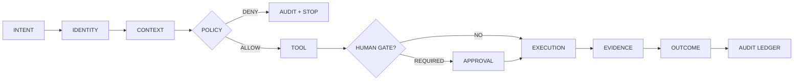
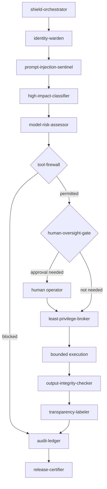
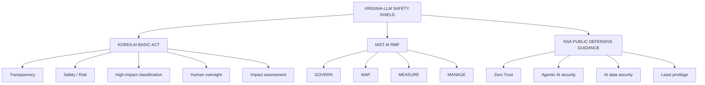

<div align="center">


# VIRGINIA-LLM // SAFETY SHIELD

### `GLASS ONION CONTROL PLANE` · `GPT-DOUG-LLM` · `24-AGENT GOVERNANCE FLEET`

**AI proposes → Shield evaluates → scoped authority executes → evidence proves what happened.**

[](./policies/shield.rego)
[](./agents/fleet-24.json)
[](./policies/shield.rego)
[](./agents/fleet-24.json)

[](https://www.law.go.kr/LSW/lsInfoP.do?chrClsCd=010203&lsiSeq=268543&urlMode=engLsInfoR&viewCls=engLsInfoR)
[](https://airc.nist.gov/airmf-resources/airmf/5-sec-core/)
[](https://www.nsa.gov/Press-Room/Press-Releases-Statements/Press-Release-View/Article/4475134/nsa-joins-the-asds-acsc-and-others-to-release-guidance-on-agentic-artificial-in/)
[](./policies/shield.rego)

</div>

---

## ⚡ Mission

**Virginia-LLM Safety Shield** is the defensive governance plane for `gpt-doug-llm`.

The Shield does not treat model output as authority. Every side-effecting action must cross an explicit chain of identity, context, risk, policy, capability, oversight, execution, and evidence controls.

> **Core invariant:** no agent receives ambient authority.

```text
INTENT → IDENTITY → CONTEXT → POLICY → TOOL → EXECUTION → EVIDENCE → OUTCOME
```

A later layer cannot silently override an earlier denial.

---

## 🧅 GLASS ONION // observable authority

`Glass Onion` is the visibility model behind the Shield: every consequential operation should be inspectable layer-by-layer instead of disappearing inside an opaque autonomous loop.



### Eight observable layers

| Layer | Question the Shield must answer | Evidence |
| --- | --- | --- |
| `01 INTENT` | What outcome was requested? | normalized mission / request ID |
| `02 IDENTITY` | Who or what is asking? | verified workload / agent identity |
| `03 CONTEXT` | Is the supplied context trusted? | provenance + injection findings |
| `04 POLICY` | Is this operation permitted? | Rego decision + deny reasons |
| `05 TOOL` | Which exact capability is requested? | allowlisted tool + scope |
| `06 EXECUTION` | What mutation actually occurred? | execution receipt / diff |
| `07 EVIDENCE` | Did validation prove the result? | tests / checks / attestations |
| `08 OUTCOME` | What survives after validation? | keep / reject / quarantine |

---

## 🪪 Credential ledger

This table is deliberately precise: **mapping is not certification** and public guidance is not affiliation.

| Credential / control | Repository evidence | Status | Meaning |
| --- | --- | --- | --- |
| **24-Agent Safety Fleet** | [`agents/fleet-24.json`](./agents/fleet-24.json) | `IMPLEMENTED MANIFEST` | Twenty-four bounded governance roles are declared |
| **Fleet Summon Runtime** | [`agents/summon.py`](./agents/summon.py) | `IMPLEMENTED` | Loads and enumerates the declared fleet |
| **OPA / Rego Safety Gate** | [`policies/shield.rego`](./policies/shield.rego) | `IMPLEMENTED POLICY` | Default-deny policy-as-code baseline |
| **Glass Onion Ontology** | [`ontology/safety-shield.ttl`](./ontology/safety-shield.ttl) | `IMPLEMENTED ONTOLOGY` | Machine-readable authority / evidence model |
| **Korea AI Basic Act** | [`policies/control-matrix.json`](./policies/control-matrix.json) | `CONTROL MAPPING` | Internal mapping to selected statutory obligations; **not legal certification** |
| **NIST AI RMF** | [`policies/control-matrix.json`](./policies/control-matrix.json) | `PROFILE MAPPING` | Internal crosswalk to `GOVERN / MAP / MEASURE / MANAGE`; **not NIST certification** |
| **NSA public defensive guidance** | [`policies/control-matrix.json`](./policies/control-matrix.json) | `REFERENCE MAPPING` | Uses public defensive guidance only; **no NSA affiliation, access, authorization, or endorsement** |
| **Human Oversight Gate** | [`agents/fleet-24.json`](./agents/fleet-24.json) | `DECLARED CONTROL` | High-impact / destructive / irreversible actions require approval |
| **Append-only Audit Model** | [`agents/fleet-24.json`](./agents/fleet-24.json) | `DECLARED CONTROL` | Decisions and execution evidence are intended to survive later agent actions |

### Official references

- **Republic of Korea AI Basic Act:** enacted as Act No. 20676 and effective **January 22, 2026** — [Korea Law Information Center](https://www.law.go.kr/LSW/lsInfoP.do?chrClsCd=010203&lsiSeq=268543&urlMode=engLsInfoR&viewCls=engLsInfoR)
- **NIST AI RMF:** the core functions are **GOVERN, MAP, MEASURE, MANAGE** — [NIST AIRC](https://airc.nist.gov/airmf-resources/airmf/5-sec-core/)
- **NSA / international partners, agentic AI:** public guidance on careful adoption and agentic-AI attack-surface / autonomy risks, released **April 30, 2026** — [NSA](https://www.nsa.gov/Press-Room/Press-Releases-Statements/Press-Release-View/Article/4475134/nsa-joins-the-asds-acsc-and-others-to-release-guidance-on-agentic-artificial-in/)

---

## 🛰️ 24-agent defensive fleet

| # | Agent | Control domain |
| ---: | --- | --- |
| 01 | `shield-orchestrator` | governance |
| 02 | `identity-warden` | zero trust |
| 03 | `least-privilege-broker` | zero trust |
| 04 | `prompt-injection-sentinel` | AI security |
| 05 | `tool-firewall` | execution security |
| 06 | `data-provenance-keeper` | data lineage |
| 07 | `privacy-guardian` | privacy |
| 08 | `secret-scanner` | secret hygiene |
| 09 | `supply-chain-auditor` | software / model supply chain |
| 10 | `model-risk-assessor` | AI risk measurement |
| 11 | `high-impact-classifier` | regulatory classification |
| 12 | `korea-ai-basic-act` | statutory mapping |
| 13 | `nist-rmf-governor` | AI RMF mapping |
| 14 | `nsa-guidance-mapper` | public defensive guidance mapping |
| 15 | `human-oversight-gate` | human authority |
| 16 | `explainability-recorder` | decision evidence |
| 17 | `transparency-labeler` | disclosure |
| 18 | `output-integrity-checker` | quality / integrity |
| 19 | `red-team-agent` | authorized sandbox testing |
| 20 | `incident-sentinel` | detection / response |
| 21 | `kill-switch-custodian` | containment |
| 22 | `audit-ledger` | evidence |
| 23 | `glass-onion-observer` | observability |
| 24 | `release-certifier` | release gating |

### Fleet authority model



---

## 🔐 Default-deny execution contract

The current Rego baseline permits only bounded operations that meet explicit conditions.

```rego
package virginia_llm.safety

default allow := false

allow if {
  input.identity.verified == true
  input.capability.scope_permits == true
  not input.context.prompt_injection_detected
  input.risk.score < 0.70
  input.action.reversible == true
}
```

High-impact operations should instead require valid human approval plus a pre-commit audit event.

**Policy source:** [`policies/shield.rego`](./policies/shield.rego)

---

## 🧠 Regulatory control plane



Crosswalk source: [`policies/control-matrix.json`](./policies/control-matrix.json)

---

## 🚦 Shield states

| State | Meaning | Execution |
| --- | --- | --- |
| 🟢 `GREEN` | verified + scoped + low-risk + reversible | permitted |
| 🟠 `AMBER` | elevated uncertainty / high-impact classification | human gate |
| 🔴 `RED` | injection, scope violation, failed identity, prohibited operation | denied |
| ⚫ `BLACK` | active incident / compromised route | quarantined |

---

## ⚙️ Summon the fleet

```bash
python3 safety-shield/agents/summon.py
```

Expected control-plane declaration:

```text
SUMMONING 24 SAFETY-SHIELD AGENTS
[01] shield-orchestrator
[02] identity-warden
...
[24] release-certifier

Fleet declared. Execution remains policy-gated and least-privileged.
```

**Summon ≠ unrestricted autonomy.** Instantiation never grants an agent authority beyond its scoped capabilities and policy decision.

---

## 📡 Evidence over claims

A Safety Shield operation is considered complete only when there is evidence for the control decision and the resulting state.

```text
REQUEST
  │
  ├── identity evidence
  ├── context provenance
  ├── risk classification
  ├── policy decision
  ├── approval evidence        ← when required
  ├── scoped capability
  ├── execution receipt
  ├── validation evidence
  └── append-only audit event
```

### Design doctrine

> **Flexible reasoning. Deterministic authority. Observable execution. Retained evidence.**

---

## ⚠️ Independence / credential statement

**Virginia-LLM, GPT-DOUG-LLM, ZYRA, NXYZ, Safety Shield, and Glass Onion are independent project artifacts.** References to NSA, NIST, the Republic of Korea, government frameworks, statutes, or cybersecurity publications identify public sources, internal control mappings, or interoperability goals only.

They do **not** represent government status, security clearance, legal certification, agency authorization, agency endorsement, or affiliation unless a separate verifiable credential explicitly establishes one.

---

<div align="center">

### `VIRGINIA-LLM // GLASS ONION`

**24 agents. One authority boundary. Every consequential action leaves evidence.**

[`ONTOLOGY`](./ontology/safety-shield.ttl) · [`FLEET`](./agents/fleet-24.json) · [`POLICY`](./policies/shield.rego) · [`CONTROL MATRIX`](./policies/control-matrix.json)

</div>
