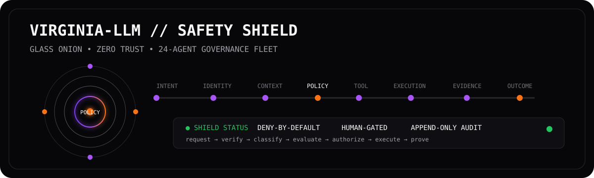
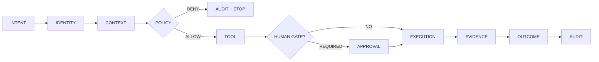

<div align="center">



# VIRGINIA-LLM // SAFETY SHIELD

### `SHADOW GLASS` → `GLASS ONION` → `ONTOLOGY` → `THE BLACK HOUSE`

**AI proposes → SHADOW GLASS evaluates trust → GLASS ONION exposes execution → evidence proves the result → humans retain authority.**

[](./policies/shield.rego)
[](./SHADOW_GLASS.md)
[](./agents/fleet-24.json)
[](./policies/shield.rego)
[](./agents/fleet-24.json)

### 👋 First time here?

**Read the [Beginner Guide](./THE_BLACK_HOUSE_BEGINNER_GUIDE.md) first.** It explains the stack with plain-English analogies and examples. Keep the [Glossary](./GLOSSARY.md) open for unfamiliar terms.

</div>

---

## 👁️ The whole system at a glance


```text
SOURCE
  ↓
SHADOW GLASS       = Should we trust/allow it?
  ↓
GLASS ONION        = Can we see exactly what happened?
  ↓
ONTOLOGY           = How does it relate to the real world?
  ↓
THE BLACK HOUSE    = What does a human need to know?
  ↓
ZYRA / XUNIA / GPT-DOUG-LLM / VIRGINIA-LLM
```

### The one rule that matters most

> **Model output is not authority.**

A model may suggest an action. The control plane decides whether that action is in scope, permitted, observable, reversible, validated, and auditable.

---

## 🧩 What each component means

| Component | Beginner analogy | Job |
| --- | --- | --- |
| **SHADOW GLASS** | Security checkpoint | Identity, provenance, confidence, scope, risk, policy |
| **GLASS ONION** | Glass-walled control room | Intent, context, tool use, execution, evidence, outcome |
| **Ontology** | Smart operational map | Objects, properties, links, actions, permissions |
| **The Black House** | Intelligence briefing desk | Converts validated evidence into readable assessments |
| **24-agent fleet** | Specialist review team | Declared bounded roles for identity, provenance, risk, policy, validation, audit, and release |

Detailed SHADOW GLASS page: [`SHADOW_GLASS.md`](./SHADOW_GLASS.md)

---

## 🧅 GLASS ONION: observable authority

GLASS ONION prevents consequential operations from disappearing inside an opaque agent loop.



| Layer | Question | Evidence |
| --- | --- | --- |
| `01 INTENT` | What outcome was requested? | request / mission ID |
| `02 IDENTITY` | Who or what is asking? | verified identity |
| `03 CONTEXT` | Is the supplied context trusted? | provenance / injection findings |
| `04 POLICY` | Is this permitted? | deterministic policy decision |
| `05 TOOL` | Which capability is requested? | allowlisted capability + scope |
| `06 EXECUTION` | What changed? | receipt / diff / state change |
| `07 EVIDENCE` | Did validation prove the result? | tests / checks / attestations |
| `08 OUTCOME` | What survives? | keep / reject / quarantine |

---

## ◼️ SHADOW GLASS: outer defensive shield

SHADOW GLASS sits **outside** GLASS ONION.

```text
UNTRUSTED OR UNKNOWN INPUT
          ↓
    SHADOW GLASS
 identity • provenance • confidence • policy
       ↙             ↘
    DENY             ALLOW
     ↓                 ↓
QUARANTINE        GLASS ONION
```

States:

| State | Meaning | Result |
| --- | --- | --- |
| 🟢 `GREEN` | verified + scoped + acceptable risk | proceed |
| 🟠 `AMBER` | meaningful uncertainty / elevated impact | human review |
| 🔴 `RED` | failed identity, scope, provenance, or policy | deny + audit |
| ⚫ `BLACK` | compromised route / integrity incident | quarantine |

---

## 🏛️ The Black House: briefing layer

A Black House brief is designed for both a novice reader and a fluent analyst.

```text
MISSION QUESTION
EXECUTIVE SUMMARY
KEY JUDGMENTS + CONFIDENCE
WHAT CHANGED
WHY IT MATTERS
EVIDENCE / SOURCES
GAPS + ALTERNATIVE EXPLANATIONS
RECOMMENDED NEXT STEP
AUDIT / VALIDATION RECORD
```

Start here: [`THE_BLACK_HOUSE_BEGINNER_GUIDE.md`](./THE_BLACK_HOUSE_BEGINNER_GUIDE.md)

---

## 🧠 Operational ontology

The project ontology uses the conceptual primitives common to Palantir Foundry's Ontology model: **object types, properties, links, actions/functions, interfaces, and granular security/governance**.

Beginner translation:

```text
OBJECT    = thing/event
PROPERTY  = fact about it
LINK      = relationship
ACTION    = controlled change
SECURITY  = who may see/change it
```

Machine-readable models:

- [`ontology/shadow-glass-palantir.json`](./ontology/shadow-glass-palantir.json)
- [`ontology/safety-shield.ttl`](./ontology/safety-shield.ttl)

---

## 🇺🇸 Public federal reference lanes

These are **public-source mission and engineering mappings only**.

| Lane | Public basis | Project use |
| --- | --- | --- |
| **U.S. Space Force** | Space-domain mission, space superiority, global mission operations, assured space access | Model mission domains, space assets, dependencies, telemetry/evidence, resiliency context |
| **NSA** | Public defensive cybersecurity and AI/software security guidance | Zero-trust, provenance, software/AI security, defensive threat intelligence, audit controls |
| **NASA** | Public datasets, APIs, science/engineering resources, released software | Dataset/software provenance, mission analysis, simulation and evidence objects |

References:
- https://www.spaceforce.mil/About-Us/About/
- https://www.nsa.gov/Cybersecurity/NSA/
- https://data.nasa.gov/
- https://www.nasa.gov/software/

**No public-reference mapping grants agency access, status, affiliation, endorsement, clearance, contract status, or authority.**

---

## 🛰️ 24-agent defensive fleet

| # | Agent | Domain |
| ---: | --- | --- |
| 01 | `shield-orchestrator` | governance |
| 02 | `identity-warden` | identity |
| 03 | `least-privilege-broker` | authorization |
| 04 | `prompt-injection-sentinel` | AI security |
| 05 | `tool-firewall` | execution security |
| 06 | `data-provenance-keeper` | lineage |
| 07 | `privacy-guardian` | privacy |
| 08 | `secret-scanner` | secret hygiene |
| 09 | `supply-chain-auditor` | software/model supply chain |
| 10 | `model-risk-assessor` | risk |
| 11 | `high-impact-classifier` | impact classification |
| 12 | `korea-ai-basic-act` | statutory mapping |
| 13 | `nist-rmf-governor` | NIST AI RMF mapping |
| 14 | `nsa-guidance-mapper` | public defensive guidance mapping |
| 15 | `human-oversight-gate` | human authority |
| 16 | `explainability-recorder` | decision evidence |
| 17 | `transparency-labeler` | disclosure |
| 18 | `output-integrity-checker` | quality/integrity |
| 19 | `red-team-agent` | authorized sandbox testing |
| 20 | `incident-sentinel` | response |
| 21 | `kill-switch-custodian` | containment |
| 22 | `audit-ledger` | evidence |
| 23 | `glass-onion-observer` | observability |
| 24 | `release-certifier` | release gate |

Manifest: [`agents/fleet-24.json`](./agents/fleet-24.json)

---

## 🔐 Default-deny policy

```rego
package virginia_llm.safety

default allow := false

allow if {
  input.identity.verified == true
  input.capability.scope_permits == true
  not input.context.prompt_injection_detected
  input.risk.score < 0.70
  input.action.reversible == true
}
```

High-impact or irreversible actions should cross a human-approval gate.

Policy source: [`policies/shield.rego`](./policies/shield.rego)

---

## 🪪 Evidence ledger: what is implemented vs. mapped

| Control | Evidence | Status |
| --- | --- | --- |
| 24-Agent Safety Fleet | [`agents/fleet-24.json`](./agents/fleet-24.json) | `IMPLEMENTED MANIFEST` |
| Fleet loader | [`agents/summon.py`](./agents/summon.py) | `IMPLEMENTED` |
| OPA/Rego baseline | [`policies/shield.rego`](./policies/shield.rego) | `IMPLEMENTED POLICY` |
| Safety ontology | [`ontology/safety-shield.ttl`](./ontology/safety-shield.ttl) | `IMPLEMENTED ONTOLOGY` |
| SHADOW GLASS ontology | [`ontology/shadow-glass-palantir.json`](./ontology/shadow-glass-palantir.json) | `IMPLEMENTED PROJECT SCHEMA` |
| NIST AI RMF | [`policies/control-matrix.json`](./policies/control-matrix.json) | `INTERNAL MAPPING — NOT CERTIFICATION` |
| NSA public defensive guidance | [`policies/control-matrix.json`](./policies/control-matrix.json) | `REFERENCE MAPPING — NO AFFILIATION` |
| Korea AI Basic Act | [`policies/control-matrix.json`](./policies/control-matrix.json) | `INTERNAL CONTROL MAPPING — NOT LEGAL CERTIFICATION` |

---

## ⚙️ Run the declared fleet

```bash
python3 safety-shield/agents/summon.py
```

This loads/enumerates the declared roles. **Summoning a role does not grant unrestricted authority.** Actual operations remain bounded by capability scope, policy, oversight, and evidence.

---

## 📚 Learning path

**Novice**
1. [`THE_BLACK_HOUSE_BEGINNER_GUIDE.md`](./THE_BLACK_HOUSE_BEGINNER_GUIDE.md)
2. [`GLOSSARY.md`](./GLOSSARY.md)
3. [`SHADOW_GLASS.md`](./SHADOW_GLASS.md)

**Technical**
1. [`ontology/shadow-glass-palantir.json`](./ontology/shadow-glass-palantir.json)
2. [`ontology/safety-shield.ttl`](./ontology/safety-shield.ttl)
3. [`policies/shield.rego`](./policies/shield.rego)
4. [`policies/control-matrix.json`](./policies/control-matrix.json)

---

## ⚠️ Independence / credibility statement

**Virginia-LLM, GPT-DOUG-LLM, ZYRA, XUNIA, RVIA, The Black House, Safety Shield, SHADOW GLASS, and GLASS ONION are independent SONOXO project artifacts.** References to U.S. government agencies, Palantir, NIST, statutes, or public cybersecurity resources describe public sources, internal mappings, architecture concepts, or interoperability goals only.

They do **not** represent federal status, military/intelligence affiliation, security clearance, contract award, procurement status, certification, agency authorization, endorsement, or access to non-public systems unless separate verifiable credentials establish that relationship.

---

<div align="center">

### `SHADOW GLASS → GLASS ONION → ONTOLOGY → THE BLACK HOUSE`

**Trust carefully. Observe execution. Preserve evidence. Explain clearly.**

[BEGINNER GUIDE](./THE_BLACK_HOUSE_BEGINNER_GUIDE.md) · [SHADOW GLASS](./SHADOW_GLASS.md) · [GLOSSARY](./GLOSSARY.md) · [ONTOLOGY](./ontology/shadow-glass-palantir.json)

</div>
