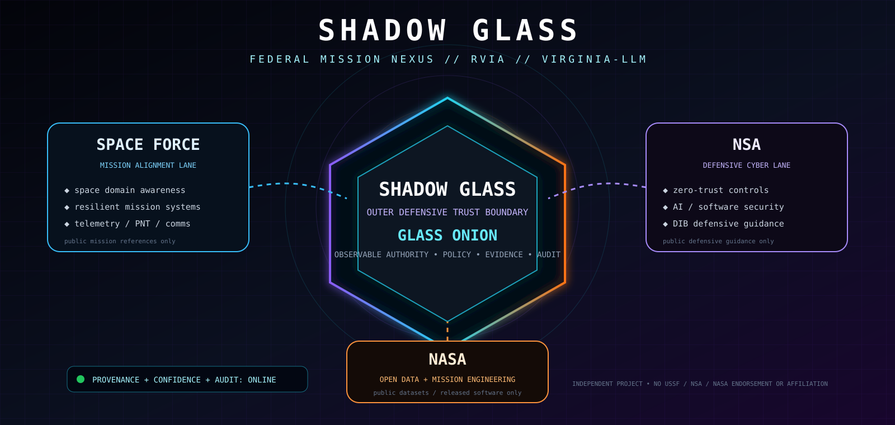
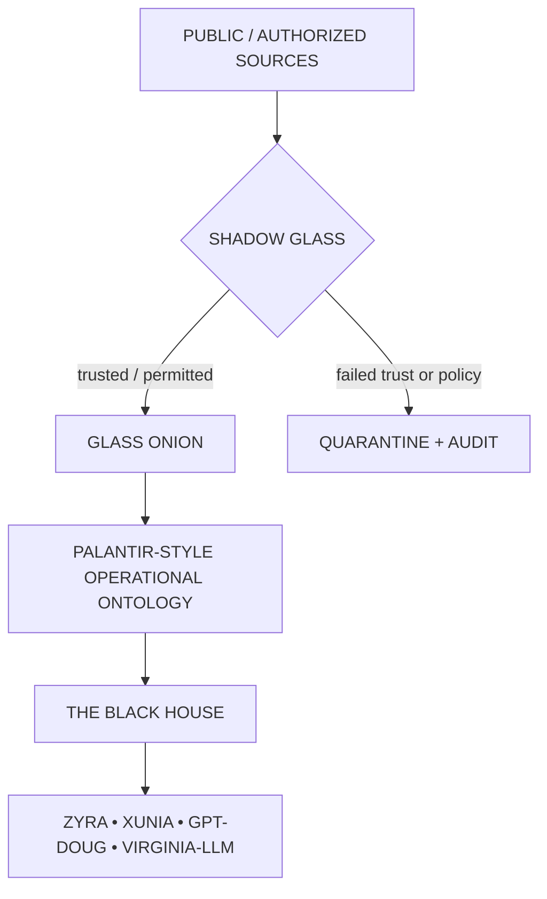

<div align="center">



# ◼️ SHADOW GLASS

### `OUTER DEFENSIVE SHIELD` · `GLASS ONION PROTECTION LAYER` · `THE BLACK HOUSE` · `RVIA / VIRGINIA-LLM`

[](./ontology/shadow-glass-palantir.json)
[](./ontology/safety-shield.ttl)
[](https://www.spaceforce.mil/About-Us/About/)
[](https://www.nsa.gov/Cybersecurity/NSA/)
[](https://data.nasa.gov/)

**SHADOW GLASS shields GLASS ONION. GLASS ONION makes authority observable. THE BLACK HOUSE turns verified evidence into understandable intelligence briefs.**

### New here?

**Start with the [Beginner Guide](./THE_BLACK_HOUSE_BEGINNER_GUIDE.md) → then use the [Glossary](./GLOSSARY.md) whenever a term is unfamiliar.**

</div>

---

## 👁️ See the whole system first


### The 30-second explanation

```text
1. INFORMATION ARRIVES
        ↓
2. SHADOW GLASS CHECKS TRUST
   identity • provenance • confidence • policy
        ↓
3. GLASS ONION SHOWS WHAT HAPPENS
   intent • context • tools • execution • evidence
        ↓
4. THE ONTOLOGY ORGANIZES REAL-WORLD MEANING
   objects • properties • links • actions • permissions
        ↓
5. THE BLACK HOUSE WRITES THE BRIEF
   judgment • confidence • evidence • gaps • next step
        ↓
6. ZYRA / XUNIA / GPT-DOUG-LLM / VIRGINIA-LLM USE IT
```

If you remember only one rule, remember this:

> **Model output is a recommendation, not automatic authority.**

---

## 🧠 What each layer does

| Layer | Simple analogy | Technical responsibility |
| --- | --- | --- |
| **SHADOW GLASS** | Security checkpoint | Validate identity, provenance, confidence, scope, risk, and policy |
| **GLASS ONION** | Glass control room | Expose intent, context, policy, tools, execution, evidence, and outcome |
| **Operational ontology** | Smart map / digital twin | Model object types, properties, links, actions, interfaces, and permissions |
| **THE BLACK HOUSE** | Intelligence briefing desk | Turn verified evidence into readable, source-traceable assessments |
| **ZYRA / XUNIA / GPT-DOUG / VIRGINIA-LLM** | Analysis and workflow engines | Consume the structured brief for authorized reasoning and workflows |

---

## 🏛️ THE BLACK HOUSE briefing contract

A Black House brief should be readable by a newcomer while remaining useful to a technical analyst.

```text
BRIEF ID / AS-OF TIME
MISSION QUESTION

EXECUTIVE SUMMARY
KEY JUDGMENTS + CONFIDENCE
WHAT CHANGED
WHY IT MATTERS
EVIDENCE / SOURCES
GAPS + ALTERNATIVE EXPLANATIONS
RECOMMENDED NEXT STEP
AUDIT / VALIDATION RECORD
```

The design goal is **fluent understanding**: a reader should be able to grasp the assessment first, then drill into the evidence and ontology only when needed.

Full walkthrough: [`THE_BLACK_HOUSE_BEGINNER_GUIDE.md`](./THE_BLACK_HOUSE_BEGINNER_GUIDE.md)

---

## 🧅 SHADOW GLASS → GLASS ONION hierarchy



### Why two defensive layers?

**SHADOW GLASS asks “should this be allowed to enter or execute?”**

**GLASS ONION asks “can we see and prove exactly what happened?”**

That separation keeps trust decisions distinct from observability.

---

## 🧩 Palantir-style ontology contract

Palantir Foundry describes its Ontology as an operational layer connecting real-world entities and events to semantic elements such as **objects, properties, and links**, plus kinetic elements such as **actions, functions, and dynamic security**. SHADOW GLASS uses those conceptual primitives in its own independent project schema.

### Beginner translation

```text
OBJECT     = a thing or event
PROPERTY   = a fact about it
LINK       = a relationship
ACTION     = a controlled change
SECURITY   = who may see/change what
```

### Core object types

```text
AgencyReference
MissionDomain
SpaceAsset
TelemetryEvent
CyberFinding
ThreatIndicator
Dataset
SoftwareArtifact
EvidenceArtifact
IntelligenceBrief
ControlDecision
AgentAction
```

### Example links

```text
SpaceAsset         ─PRODUCES─────→ TelemetryEvent
CyberFinding       ─SUPPORTED_BY─→ EvidenceArtifact
Dataset            ─PUBLISHED_BY─→ AgencyReference
SoftwareArtifact   ─RELEASED_BY──→ AgencyReference
IntelligenceBrief  ─DERIVED_FROM─→ EvidenceArtifact
ControlDecision    ─GUARDS───────→ AgentAction
GlassOnion         ─PROTECTED_BY─→ ShadowGlass
```

### Controlled actions

```text
ingestPublicSource
validateProvenance
scoreConfidence
publishBrief
approveBoundedAction
quarantineArtifact
revokeTrust
```

Machine-readable model: [`ontology/shadow-glass-palantir.json`](./ontology/shadow-glass-palantir.json)

---

## 🇺🇸 Public federal mission-alignment lanes

These are **public-source research and engineering mappings**. They are deliberately separated from credentials or claims of relationship.

### 🛰️ U.S. Space Force

The Space Force publicly states its mission is to secure U.S. interests **in, from, and to space**. Its published core functions include space superiority, global mission operations, and assured space access, with mission areas including missile warning, satellite communications, positioning/navigation/timing, cyber, and space-domain awareness.

**SHADOW GLASS mapping:**

```text
SpaceAsset
TelemetryEvent
MissionDomain
Dependency
EvidenceArtifact
ResilienceAssessment
IntelligenceBrief
```

Public reference: https://www.spaceforce.mil/About-Us/About/

### 🛡️ NSA defensive cybersecurity

This lane uses **public defensive cybersecurity, software-security, zero-trust, and AI-security guidance** plus data the operator is authorized to process.

**SHADOW GLASS mapping:**

```text
CyberFinding
ThreatIndicator
SoftwareArtifact
EvidenceArtifact
ControlDecision
IdentityContext
AuditEvent
```

The lane is defensive and governance-oriented. It is not an authorization mechanism for intrusion, credential collection, or offensive access.

Public reference: https://www.nsa.gov/Cybersecurity/NSA/

### 🚀 NASA public data + software

NASA's Open Data Portal catalogs publicly available datasets, and NASA also publishes a Software Catalog and approved open-source code resources.

**SHADOW GLASS mapping:**

```text
Dataset
SoftwareArtifact
AgencyReference
MissionDomain
EvidenceArtifact
AnalysisProduct
IntelligenceBrief
```

Public references:
- https://data.nasa.gov/
- https://www.nasa.gov/software/

---

## 🔎 Provenance + confidence

A useful intelligence system must communicate both **evidence** and **uncertainty**.

Every material judgment should answer:

1. Where did the information come from?
2. Was the source authenticated or otherwise validated?
3. Was it transformed, summarized, or derived?
4. How strongly does the evidence support the judgment?
5. What evidence is missing or contradictory?

| Score | Label | Interpretation |
| ---: | --- | --- |
| `0.90–1.00` | VERY HIGH | Strong direct and/or corroborated evidence |
| `0.75–0.89` | HIGH | Good support; limited unresolved uncertainty |
| `0.55–0.74` | MODERATE | Supported but important gaps remain |
| `0.30–0.54` | LOW | Weak, indirect, conflicting, or incomplete evidence |
| `<0.30` | UNVERIFIED | Do not present as established fact |

---

## 🚦 SHADOW GLASS states

| State | Meaning | Result |
| --- | --- | --- |
| 🟢 `GREEN` | identity, provenance, scope and confidence validated | pass into GLASS ONION |
| 🟠 `AMBER` | uncertainty or elevated operational impact | human review required |
| 🔴 `RED` | scope violation, failed validation or prohibited action | deny + audit |
| ⚫ `BLACK` | compromised route or integrity failure | quarantine |

---

## 🧪 Walkthrough: one public dataset

```text
NASA public dataset
      ↓
CAPTURE SOURCE METADATA
      ↓
SHADOW GLASS
  validate publisher + provenance + permitted use
      ↓
GLASS ONION
  record requester + tool + transformations + evidence
      ↓
ONTOLOGY
  Dataset ─PUBLISHED_BY→ NASA AgencyReference
      ↓
THE BLACK HOUSE
  summarize relevance + confidence + gaps
      ↓
ZYRA / XUNIA / GPT-DOUG / VIRGINIA-LLM
```

The same pattern applies to public advisories, public software, authorized telemetry, internal documents you are permitted to process, and other lawful sources.

---

## 📚 Learning path

**Level 1 — First visit**

1. [`THE_BLACK_HOUSE_BEGINNER_GUIDE.md`](./THE_BLACK_HOUSE_BEGINNER_GUIDE.md)
2. [`GLOSSARY.md`](./GLOSSARY.md)
3. This page

**Level 2 — Architecture**

1. [`ontology/shadow-glass-palantir.json`](./ontology/shadow-glass-palantir.json)
2. [`ontology/safety-shield.ttl`](./ontology/safety-shield.ttl)
3. [`README.md`](./README.md)

**Level 3 — Controls / implementation**

1. [`policies/shield.rego`](./policies/shield.rego)
2. [`policies/control-matrix.json`](./policies/control-matrix.json)
3. [`agents/fleet-24.json`](./agents/fleet-24.json)

---

## ⚠️ Independence / credibility boundary

**SHADOW GLASS, GLASS ONION, The Black House, RVIA, VIRGINIA-LLM, ZYRA, XUNIA, and GPT-DOUG-LLM are independent SONOXO project artifacts.** References to the U.S. Space Force, NSA, NASA, Palantir, NIST, or other organizations identify public sources, conceptual mappings, interoperability goals, or internal engineering controls only.

They do **not** establish government status, military/intelligence affiliation, security clearance, procurement status, contract award, certification, agency authorization, endorsement, or access to non-public systems. Any such relationship must be established by separate verifiable credentials.

---

<div align="center">

### `SHADOW GLASS → GLASS ONION → ONTOLOGY → THE BLACK HOUSE`

**Trust the source carefully. Make execution observable. Model the world clearly. Brief the human fluently.**

[BEGINNER GUIDE](./THE_BLACK_HOUSE_BEGINNER_GUIDE.md) · [GLOSSARY](./GLOSSARY.md) · [ONTOLOGY](./ontology/shadow-glass-palantir.json) · [SAFETY SHIELD](./README.md)

</div>
