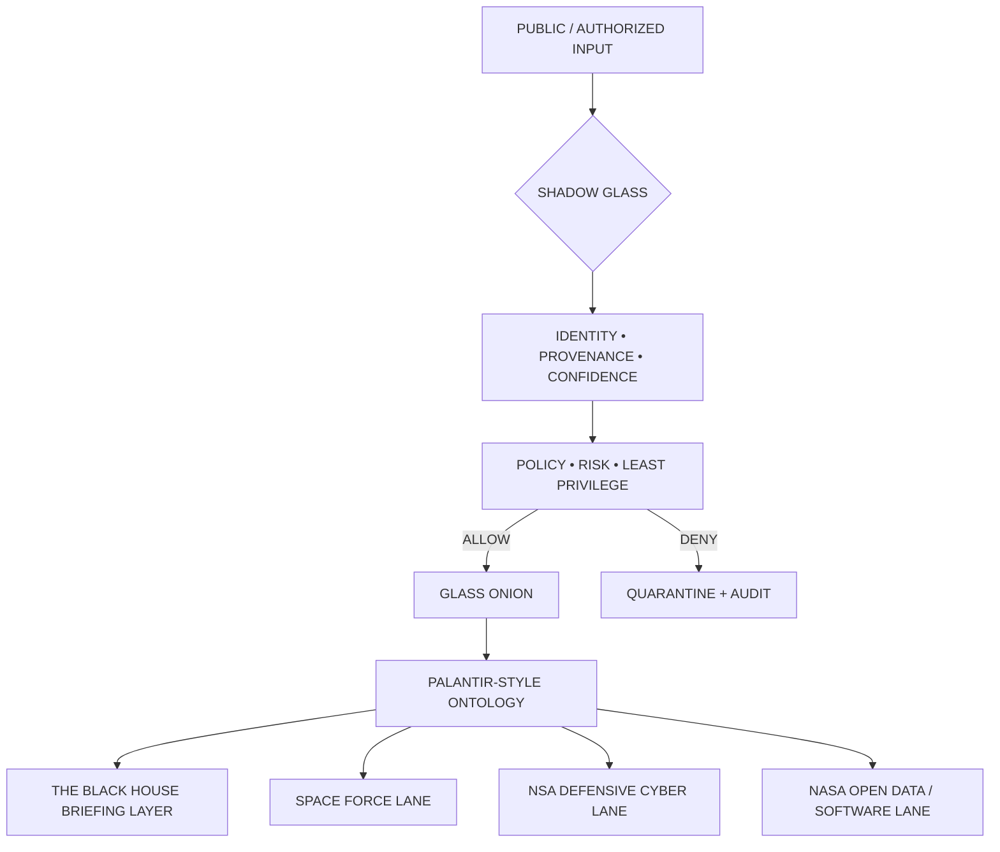

<div align="center">


# ◼️ SHADOW GLASS

### `OUTER DEFENSIVE SHIELD` · `GLASS ONION PROTECTION LAYER` · `RVIA / VIRGINIA-LLM`

[](./ontology/shadow-glass-palantir.json)
[](./ontology/safety-shield.ttl)
[](https://www.spaceforce.mil/About-Us/About/)
[](https://www.nsa.gov/Cybersecurity/NSA/)
[](https://data.nasa.gov/)

**SHADOW GLASS shields GLASS ONION. GLASS ONION makes authority observable.**

</div>

---

## Mission architecture



### Agency-alignment lanes

| Lane | Public mission basis | SHADOW GLASS implementation target |
| --- | --- | --- |
| **U.S. Space Force** | Secure U.S. interests in, from, and to space | Space-asset objects, telemetry provenance, resilient mission-system evidence, PNT/comms/missile-warning context |
| **NSA** | Defensive cybersecurity, AI security, DIB hardening, technical guidance | Zero-trust gates, AI/software security controls, provenance, least privilege, audit and defensive threat-intel objects |
| **NASA** | Public science/mission datasets and released engineering software | Open-data ingestion, software provenance, mission-analysis artifacts, simulation and engineering evidence |

## Palantir-style ontology contract

The ontology is modeled around the same core primitives used by modern operational ontologies: **object types, properties, link types, action types, interfaces, and granular security**.

```text
OBJECTS
  AgencyReference
  MissionDomain
  SpaceAsset
  TelemetryEvent
  CyberFinding
  ThreatIndicator
  Dataset
  SoftwareArtifact
  EvidenceArtifact
  IntelligenceBrief
  ControlDecision

LINKS
  SpaceAsset      -> PRODUCES      -> TelemetryEvent
  CyberFinding    -> SUPPORTED_BY  -> EvidenceArtifact
  Dataset         -> PUBLISHED_BY  -> AgencyReference
  SoftwareArtifact-> RELEASED_BY   -> AgencyReference
  IntelligenceBrief -> DERIVED_FROM -> EvidenceArtifact
  ControlDecision -> GUARDS        -> AgentAction
  GlassOnion      -> PROTECTED_BY  -> ShadowGlass

ACTIONS
  ingestPublicSource
  validateProvenance
  scoreConfidence
  publishBrief
  approveBoundedAction
  quarantineArtifact
  revokeTrust
```

Machine-readable specification: [`ontology/shadow-glass-palantir.json`](./ontology/shadow-glass-palantir.json)

## SHADOW GLASS states

| State | Meaning | Result |
| --- | --- | --- |
| 🟢 `GREEN` | identity, provenance, scope and confidence validated | pass into Glass Onion |
| 🟠 `AMBER` | uncertainty or elevated operational impact | human review required |
| 🔴 `RED` | scope violation, failed validation or prohibited action | deny + audit |
| ⚫ `BLACK` | compromised route or integrity failure | quarantine |

## Operating doctrine

```text
PUBLIC / AUTHORIZED SOURCE
        ↓
SHADOW GLASS
  identity + provenance + confidence + policy
        ↓
GLASS ONION
  intent + context + tool + execution + evidence
        ↓
ONTOLOGY
  object graph + links + action controls
        ↓
THE BLACK HOUSE
  briefing + assessment + decision support
        ↓
ZYRA • XUNIA • GPT-DOUG-LLM • VIRGINIA-LLM
```

## Independence boundary

**SHADOW GLASS, GLASS ONION, TheBlackHouse, RVIA, Virginia-LLM, ZYRA, XUNIA and GPT-DOUG-LLM are independent SONOXO project artifacts.** References to the U.S. Space Force, NSA, NASA, Palantir, or other government/industry organizations describe public mission information, public technical resources, interoperability concepts, or internal control mappings only. They do **not** indicate government status, security clearance, contract award, certification, authorization, endorsement, or affiliation.

### Public reference anchors

- U.S. Space Force mission: https://www.spaceforce.mil/About-Us/About/
- NSA Cybersecurity: https://www.nsa.gov/Cybersecurity/NSA/
- NSA Cybersecurity Collaboration Center: https://www.nsa.gov/About/Cybersecurity-Collaboration-Center/Overview/
- NASA Open Data: https://data.nasa.gov/
- NASA Software: https://www.nasa.gov/software/
- Palantir Ontology overview: https://www.palantir.com/docs/foundry/ontology/overview
