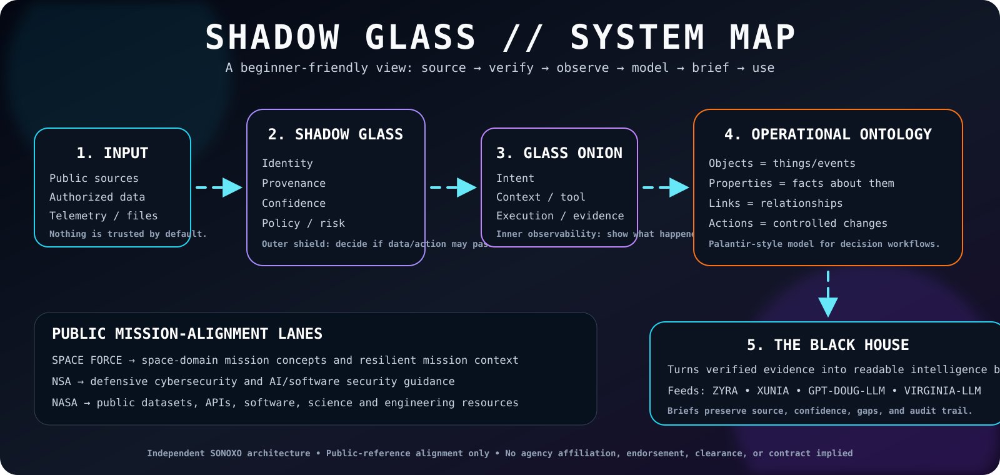

# 🏛️ THE BLACK HOUSE — Beginner Guide

> **Purpose:** turn public or otherwise authorized information into source-traceable intelligence briefs that ZYRA, XUNIA, GPT-DOUG-LLM, and VIRGINIA-LLM can understand and use safely.

If this is your first time here, start on this page.

---

## 1) What is this in one sentence?

**The Black House is the briefing layer; SHADOW GLASS is the outer trust shield; GLASS ONION is the inner observability layer; the ontology is the structured map that connects evidence to decisions.**



---

## 2) The system in plain English

Imagine a newsroom, security checkpoint, glass control room, database, and briefing desk working together:

| Part | Beginner analogy | What it actually does |
| --- | --- | --- |
| **SHADOW GLASS** | Security checkpoint | Checks identity, source provenance, confidence, scope, risk, and policy before information/actions move forward |
| **GLASS ONION** | Glass-walled control room | Makes intent, context, tools, execution, evidence, and outcomes observable |
| **Ontology** | Smart map of everything | Represents objects, facts, relationships, actions, and permissions in a machine-readable way |
| **The Black House** | Intelligence briefing desk | Converts validated evidence into concise briefs with confidence, gaps, and sources |
| **ZYRA / XUNIA / GPT-DOUG / VIRGINIA-LLM** | Operators and analysis engines | Consume the structured brief for search, reasoning, workflows, software, or authorized decision support |

### Core rule

```text
MODEL OUTPUT ≠ AUTHORITY
```

A model may recommend something. SHADOW GLASS and the surrounding control plane decide whether any consequential action is permitted.

---

## 3) Follow one piece of information through the system

Example: a new public NASA dataset is discovered.

```text
NASA PUBLIC DATASET
      ↓
[1] SOURCE CAPTURE
    URL, publisher, timestamp, checksum
      ↓
[2] SHADOW GLASS
    Is the source what it claims to be?
    How confident are we?
    Is the use permitted?
      ↓
[3] GLASS ONION
    Who requested it?
    Which tool processed it?
    What transformations happened?
    What evidence proves the result?
      ↓
[4] ONTOLOGY
    Dataset ─PUBLISHED_BY→ AgencyReference
    Dataset ─SUPPORTS→ MissionDomain
      ↓
[5] THE BLACK HOUSE
    Produce a readable assessment
      ↓
[6] CONSUMERS
    ZYRA / XUNIA / GPT-DOUG / VIRGINIA-LLM
```

The same pattern works for public cybersecurity advisories, software releases, space-domain references, telemetry from systems you are authorized to operate, internal documents you are authorized to process, and other lawful sources.

---

## 4) How confidence works

Every important analytic statement should be able to answer four questions:

1. **Where did this come from?** — provenance
2. **How reliable is the source?** — source quality
3. **How strongly does the evidence support the claim?** — analytic confidence
4. **What could still make this wrong?** — gaps / alternatives

Suggested confidence labels:

| Score | Label | Human meaning |
| ---: | --- | --- |
| `0.90–1.00` | VERY HIGH | Strong direct evidence from authoritative or independently corroborated sources |
| `0.75–0.89` | HIGH | Good evidence with limited unresolved uncertainty |
| `0.55–0.74` | MODERATE | Plausible and supported, but important gaps remain |
| `0.30–0.54` | LOW | Weak, indirect, conflicting, or incomplete evidence |
| `<0.30` | UNVERIFIED | Do not present as established fact |

Confidence is not a substitute for evidence. It is a compact way to communicate uncertainty.

---

## 5) What is a Palantir-style ontology?

Palantir Foundry describes an ontology as an operational layer that maps real-world entities and events into **objects**, their **properties**, the **links** between them, and controlled **actions/functions**. SHADOW GLASS follows those conceptual primitives in its project schema; it is not claiming to be Palantir software itself.

### Beginner translation

```text
Object    = a thing or event
Property  = a fact about that thing
Link      = how two things relate
Action    = a controlled way to change something
Security  = who may see or change what
```

Example:

```text
Object:       Dataset
Properties:   title, publisher, url, timestamp, checksum
Link:         Dataset → PUBLISHED_BY → AgencyReference
Action:       validateProvenance(dataset)
Security:     read=allowed role; publish=briefing role; mutation=policy-gated
```

Machine-readable schema: [`ontology/shadow-glass-palantir.json`](./ontology/shadow-glass-palantir.json)

---

## 6) The three federal public-reference lanes

These lanes are **research and interoperability mappings**, not badges, credentials, or agency relationships.

### 🛰️ U.S. Space Force lane

Public mission concepts include securing U.S. interests **in, from, and to space**, space superiority, global mission operations, assured space access, missile warning, satellite communications, positioning/navigation/timing, cyber, and space domain awareness.

SHADOW GLASS models those ideas as mission domains, assets, telemetry/evidence, dependencies, resilience context, and briefing objects.

### 🛡️ NSA defensive-cyber lane

The lane is limited to **public defensive cybersecurity and AI/software-security guidance** plus authorized defensive data. It supports provenance, zero-trust thinking, least privilege, software/AI supply-chain evidence, auditability, and defensive threat intelligence.

It is not a mechanism for unauthorized access or offensive operations.

### 🚀 NASA public-data/software lane

NASA exposes public dataset catalogs and released software resources. SHADOW GLASS can represent those public resources as Dataset, SoftwareArtifact, EvidenceArtifact, MissionDomain, and AgencyReference objects while retaining publisher/source metadata.

---

## 7) What a Black House brief should contain

Every operational brief should be understandable without opening the raw source first.

```text
BRIEF ID
TITLE
DATE / AS-OF TIME
MISSION / QUESTION

EXECUTIVE SUMMARY
- 3–6 plain-language bullets

KEY JUDGMENTS
- Judgment
- Confidence
- Evidence references

WHAT CHANGED
- New information vs. previous state

WHY IT MATTERS
- Operational or technical relevance

EVIDENCE
- source
- publisher
- timestamp
- hash / reference when available

GAPS / ALTERNATIVES
- what remains uncertain
- plausible competing explanations

RECOMMENDED NEXT STEP
- read-only / research / human review / bounded authorized action

AUDIT
- who/what generated the brief
- tools used
- validation performed
```

---

## 8) Safety states

| State | Meaning | What happens next |
| --- | --- | --- |
| 🟢 **GREEN** | Verified, scoped, low-risk | Continue |
| 🟠 **AMBER** | Important uncertainty or elevated impact | Human review |
| 🔴 **RED** | Failed trust/policy/scope check | Deny and record why |
| ⚫ **BLACK** | Integrity compromise or incident | Quarantine and investigate |

---

## 9) Where to go next

1. Read [`SHADOW_GLASS.md`](./SHADOW_GLASS.md) for the operational overview.
2. Open [`ontology/shadow-glass-palantir.json`](./ontology/shadow-glass-palantir.json) for the machine-readable model.
3. Read [`ontology/safety-shield.ttl`](./ontology/safety-shield.ttl) for the RDF-style safety ontology.
4. Review [`README.md`](./README.md) for the larger Safety Shield control plane.

---

## Independence / credibility boundary

**SHADOW GLASS, GLASS ONION, The Black House, RVIA, VIRGINIA-LLM, ZYRA, XUNIA, and GPT-DOUG-LLM are independent SONOXO project artifacts.** References to the U.S. Space Force, NSA, NASA, Palantir, NIST, or other organizations refer to public materials, conceptual mappings, interoperability goals, or internal engineering controls. They do not represent government affiliation, clearance, contract award, certification, authorization, or endorsement unless a separate verifiable credential establishes that relationship.
