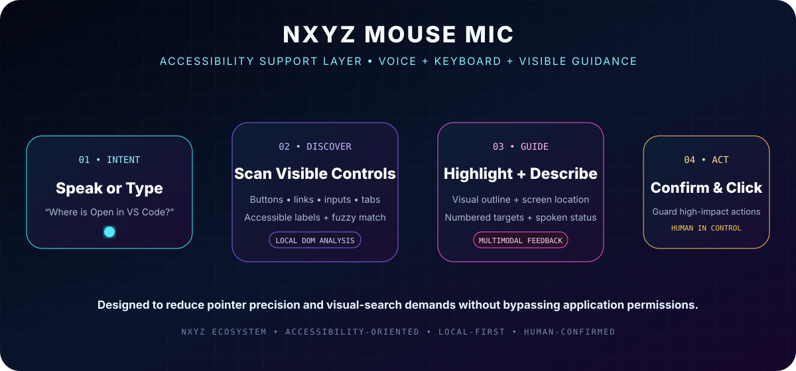
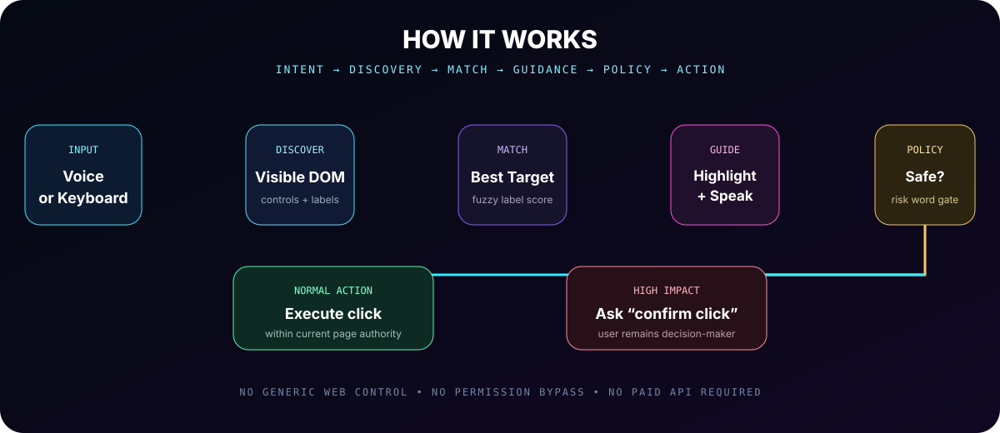
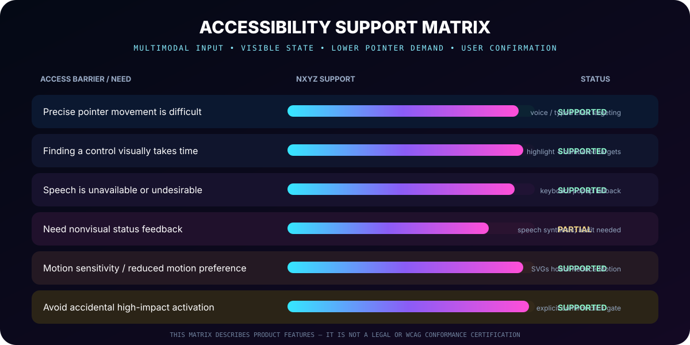
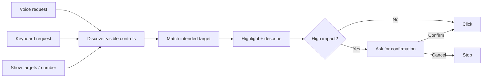
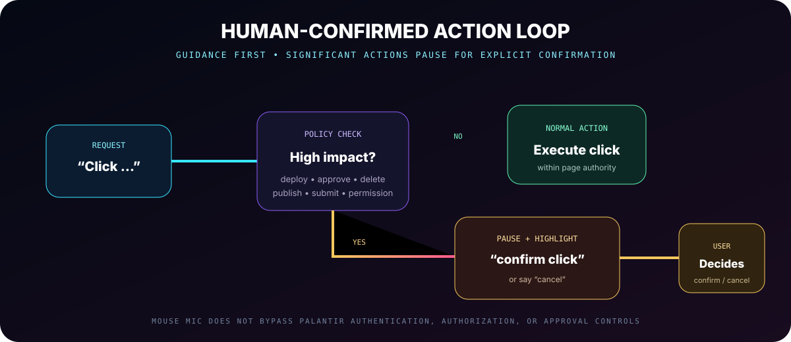
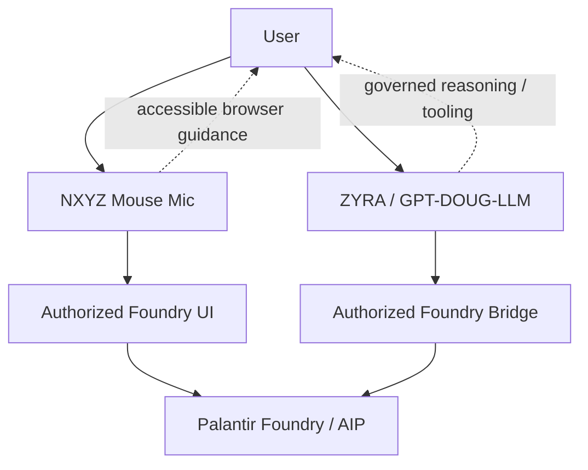

<div align="center">



# NXYZ Mouse Mic

### Voice + keyboard click guidance for complex Palantir Foundry interfaces

**Reduce pointer precision. Reduce visual search. Keep the user in control.**

[How it works](#how-it-works) · [Accessibility](#accessibility-first-interaction) · [Install](#install) · [Commands](#commands) · [Safety](#human-confirmed-safety) · [Specs](./SPECS.md) · [Accessibility notes](./ACCESSIBILITY.md)

</div>

---

## The product

NXYZ Mouse Mic is a free Chrome/Chromium accessibility-supporting extension for authorized Palantir Foundry pages.

Instead of requiring a user to visually hunt for a small control and precisely move a pointer to it, Mouse Mic lets the user **speak or type what they are trying to reach**.

Mouse Mic then:

1. discovers visible interactive controls;
2. reads available accessible labels and visible text;
3. finds the strongest target match;
4. highlights the target and describes its screen location;
5. optionally activates the control;
6. pauses for explicit confirmation before potentially high-impact actions.

> **Accessibility position:** NXYZ Mouse Mic is designed to support accessible interaction. It is not represented as an ADA certification, WCAG conformance certification, or a guarantee that a third-party application is legally compliant. See [`ACCESSIBILITY.md`](./ACCESSIBILITY.md).

---

## How it works



### Example

On **Foundry → Developer Tools → Code Templates**:

```text
where is Python Compute module
```

Mouse Mic scans the visible controls, finds the closest label match, scrolls the control into view, highlights it, and tells the user where it is.

Then:

```text
click Python Compute module
```

For a normal navigation control, Mouse Mic activates it. For a potentially consequential control such as `deploy`, `publish`, `approve`, `submit`, or `delete`, Mouse Mic stops and requires:

```text
confirm click
```

---

## Accessibility-first interaction



Mouse Mic is designed around **multimodal access** rather than a voice-only interface.

| User need | Product behavior |
| --- | --- |
| Reduced pointer precision | Find and activate visible controls by name or number |
| Reduced visual-search demand | High-contrast target highlighting and numbered overlays |
| Speech unavailable or unwanted | Full typed-command fallback in the extension popup |
| Audible guidance useful | Browser speech synthesis announces target and screen location |
| Visible confirmation useful | Persistent status panel reports what Mouse Mic heard and did |
| Motion sensitivity | NXYZ documentation visuals honor `prefers-reduced-motion` |
| Accidental activation risk | Significant actions pause for explicit confirmation |
| Existing enterprise controls | Foundry authentication, authorization, and approvals remain authoritative |

### Three interaction paths



The design principle is simple:

> **Reduce interaction friction without reducing user control.**

---

## Human-confirmed safety



Mouse Mic treats controls containing terms such as these as potentially significant:

`delete` · `remove` · `destroy` · `terminate` · `revoke` · `grant` · `permission` · `submit` · `purchase` · `pay` · `deploy` · `publish` · `approve` · `merge` · `send` · `invite` · `create account` · `reset`

Those controls are **highlighted but not immediately clicked**.

This is a local interaction safeguard. It does not replace Foundry authorization, tenant policy, approval workflows, or organizational controls.

---

## NXYZ / ZYRA ecosystem fit

Mouse Mic is the **human-interface accessibility layer** for the broader NXYZ/ZYRA ecosystem.



Mouse Mic and the GPT-DOUG Foundry bridge solve different problems:

- **Mouse Mic:** helps a person navigate and activate visible browser controls.
- **GPT-DOUG Foundry bridge:** provides code-level access to authorized Ontology data/actions when separately configured.

Mouse Mic does **not** inherit GPT-DOUG privileges, Foundry API credentials, or additional permissions.

---

## Accessibility / ADA posture

NXYZ is treating accessibility as an engineering requirement, not a marketing badge.

Current implemented accessibility-supporting features include:

- voice and keyboard command paths;
- accessible-name-aware target discovery;
- visible target highlighting;
- numbered clickable-target overlays;
- spoken target/location feedback;
- typed fallback when speech recognition is unavailable;
- explicit confirmation for significant actions;
- reduced-motion support in repository visuals;
- no generic `<all_urls>` access;
- no developer-operated backend required for normal operation.

Formal ADA/WCAG claims require contextual testing and an accessibility audit. Areas explicitly marked for further testing include screen-reader interoperability, complete keyboard-only workflows, contrast measurement, zoom/reflow, and assistive-technology testing.

Read the full engineering posture and audit checklist: **[`ACCESSIBILITY.md`](./ACCESSIBILITY.md)**.

---

## Install

### Chrome Web Store

The repository package is prepared for Chrome Web Store submission. Until the Store listing is approved, install the development build:

1. Download or clone `sonoxo/gpt-doug-llm`.
2. Open `chrome://extensions`.
3. Enable **Developer mode**.
4. Click **Load unpacked**.
5. Select:

```text
tools/nxyz-mouse-mic
```

6. Open an authorized Palantir Foundry page.
7. The purple microphone control appears in the lower-right corner.

No paid API key is required.

---

## Commands

| Command | Result |
| --- | --- |
| `show targets` | Numbers visible interactive controls |
| `where is Open in VS Code` | Highlights and describes the best target |
| `click Open in VS Code` | Activates the best matching normal control |
| `click number 12` | Activates numbered target 12 |
| `scroll down` | Scrolls down approximately one viewport |
| `scroll up` | Scrolls up approximately one viewport |
| `clear labels` | Removes numbered overlays/highlights |
| `confirm click` | Confirms a pending significant action |
| `cancel` | Cancels pending action and clears guidance |
| `help` | Speaks available command examples |

Plain speech defaults to **guidance**, not automatic clicking.

---

## What runs locally

- DOM scanning
- visible-control discovery
- fuzzy target matching
- target numbering
- highlighting
- safety-word checks
- typed commands

Speech synthesis uses browser-provided speech support. Voice recognition uses the browser Web Speech implementation when available; browser/vendor behavior may involve its own speech service.

NXYZ Mouse Mic itself does not require a paid AI API or developer-operated inference backend.

---

## Release

**Current shipping candidate: `1.0.2` · Manifest V3**

| Property | Shipping value |
| --- | --- |
| Browser | Chrome / Chromium |
| Category target | Accessibility |
| Host scope | `https://*.palantirfoundry.com/*` |
| Permissions | `activeTab`, `scripting` |
| `<all_urls>` | Not requested |
| Chrome `storage` | Not requested |
| Paid API | Not required |
| External backend | Not required |
| High-impact confirmation | Enabled |
| Icons | 16×16, 48×48, 128×128 PNG |

Full release contract: **[`SPECS.md`](./SPECS.md)**.

---

## Product files

```text
nxyz-mouse-mic/
├── assets/
│   ├── nxyz-mouse-mic-accessibility-hero.svg
│   ├── nxyz-mouse-mic-flow.svg
│   ├── nxyz-mouse-mic-accessibility-matrix.svg
│   └── nxyz-mouse-mic-safety-loop.svg
├── icons/
│   ├── icon16.png
│   ├── icon48.png
│   └── icon128.png
├── manifest.json
├── content.js
├── overlay.css
├── popup.html
├── popup.js
├── ACCESSIBILITY.md
├── SPECS.md
├── STORE-LISTING.md
├── PRIVACY.md
└── PUBLISH-CHECKLIST.md
```

---

## Shipping documents

- **[Accessibility engineering notes](./ACCESSIBILITY.md)** — design posture, limitations, audit checklist.
- **[Shipping specification](./SPECS.md)** — runtime scope, permissions, acceptance criteria.
- **[Chrome Web Store listing](./STORE-LISTING.md)** — product/reviewer copy.
- **[Privacy policy](./PRIVACY.md)** — public privacy statement.
- **[Publish checklist](./PUBLISH-CHECKLIST.md)** — release gate.
- **[Icon inventory](./icons/README.md)** — production icon specifications.

---

## Scope and independence

NXYZ Mouse Mic is independent software. It is not a Palantir product and does not imply Palantir endorsement, certification, or affiliation.

The extension is intentionally restricted to authorized Palantir Foundry tenant pages and does not bypass authentication, permissions, approvals, or application security controls.

## License

Part of [`sonoxo/gpt-doug-llm`](https://github.com/sonoxo/gpt-doug-llm) and distributed under the repository license.
