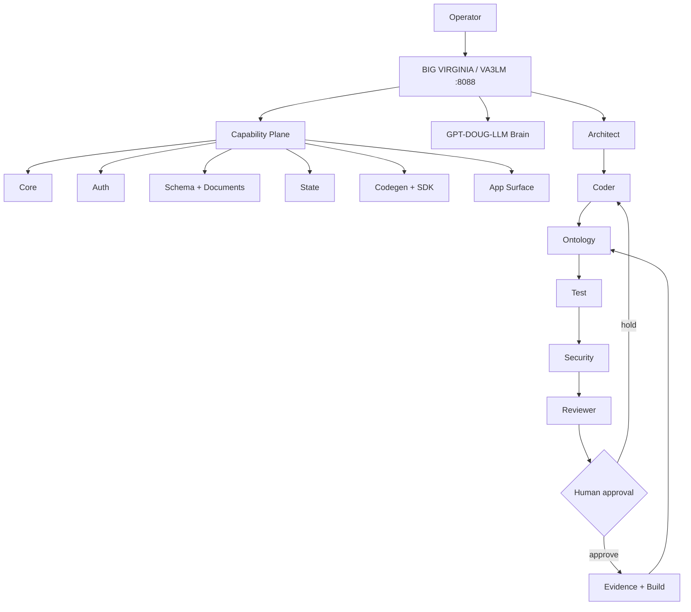

# BIG VIRGINIA // VA3LM

**Virginia Agentic Large Learning Language Model — v0.2.0**

Coding, orchestration, ontology, capability, and evidence command center for **GPT-DOUG-LLM**, **ZYRA**, and the wider RVIA/VA stack.

- Port: **8088**
- Agent swarm
- PACK-inspired capability plane
- Coding workflows
- Palantir-style ontology blueprint
- Test + security gates
- Human approval before write/publish actions
- Commercial/explainer agent for plain-language demos

## BIG VIRGINIA capability plane

VA3LM now adapts architecture patterns from `sonoxo/pack` across ten capability areas:

`CORE → AUTH → SCHEMA → DOCUMENTS → STATE → CODEGEN → SDK → APP → APP SCAFFOLD → MONOREPO/CI`

PACK itself is marked **ALPHA / not intended for production use**, so VA3LM treats it as an architectural reference rather than blindly importing it as a production dependency. VA3LM-owned tests, security gates, approval gates, and deployment validation remain authoritative.

```bash
va3lm capabilities
```

```text
GET /api/capabilities
GET /api/status
```

Full mapping: [`docs/PACK_CAPABILITY_PLANE.md`](docs/PACK_CAPABILITY_PLANE.md)

## Run

```bash
cd va3lm
python3 -m venv .venv
source .venv/bin/activate
pip install -e '.[dev]'
va3lm serve
```

Open `http://127.0.0.1:8088`.

## Interactive command deck

```bash
va3lm agents
va3lm capabilities
va3lm ontology
va3lm plan "Build a FastAPI endpoint with tests"
va3lm explain "VA3LM ontology workflow"
```

Activate the configured GPT-DOUG-LLM brain:

```bash
export VA3LM_MODEL_URL=http://127.0.0.1:11434/v1
export VA3LM_MODEL_NAME=gpt-doug-llm
va3lm brain "Refactor this service safely"
```

Start the 8088 command center:

```bash
va3lm serve --host 127.0.0.1 --port 8088
```

## Ecosystem



## API

| Method | Route | Purpose |
|---|---|---|
| GET | `/healthz` | health |
| GET | `/api/status` | runtime + capability status |
| GET | `/api/agents` | agent roster |
| GET | `/api/ontology` | ontology |
| GET | `/api/capabilities` | Big Virginia capability manifest |
| POST | `/api/plan` | build workflow |
| POST | `/api/brain` | ask configured model |
| POST | `/api/explain` | generate commercial-style explainer |

## Development

```bash
pytest -q
ruff check src tests
bandit -q -ll -r src
python -m compileall -q src
```

The dedicated `VA3LM Big Virginia` GitHub Actions gate also verifies the capability manifest can be produced by the installed CLI.

Private software project. Not a government agency.
