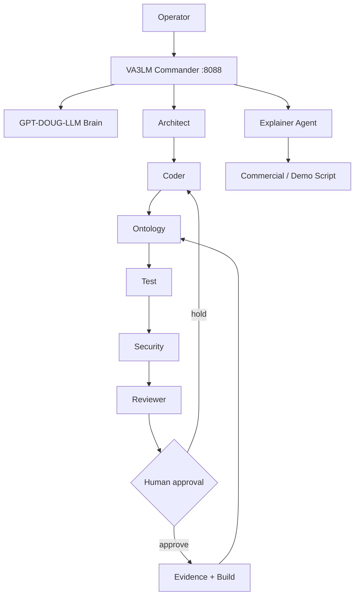

# VA3LM

**Virginia Agentic Large Learning Language Model**

Coding and programming AI command center for **GPT-DOUG-LLM** and **ZYRA**.

- Port: **8088**
- Agent swarm
- Coding workflows
- Palantir-style ontology blueprint
- Test + security gates
- Human approval before write/publish actions
- Commercial/explainer agent for plain-language demos

## Run

```bash
cd va3lm
python3 -m venv .venv
source .venv/bin/activate
pip install -e '.[dev]'
va3lm serve
```

Open `http://127.0.0.1:8088`.

## Interactive command deck

<details open>
<summary><strong>Summon agents</strong></summary>

```bash
va3lm agents
```
</details>

<details>
<summary><strong>Build a coding workflow</strong></summary>

```bash
va3lm plan "Build a FastAPI endpoint with tests"
```
</details>

<details>
<summary><strong>Explain VA3LM like a commercial</strong></summary>

```bash
va3lm explain "VA3LM ontology workflow"
```

Output follows: **problem → what it is → how it works → proof → benefit → CTA**.
</details>

<details>
<summary><strong>Inspect ontology</strong></summary>

```bash
va3lm ontology
```
</details>

<details>
<summary><strong>Activate GPT-DOUG-LLM brain</strong></summary>

```bash
export VA3LM_MODEL_URL=http://127.0.0.1:11434/v1
export VA3LM_MODEL_NAME=gpt-doug-llm
va3lm brain "Refactor this service safely"
```
</details>

<details>
<summary><strong>Start the 8088 command center</strong></summary>

```bash
va3lm serve --host 127.0.0.1 --port 8088
```
</details>

## Ecosystem



## Commercial explainer pattern

```text
HOOK:      What problem are we fixing?
SIMPLE:    What is VA3LM in one sentence?
SHOW:      What happens when you give it a task?
PROOF:     What tests, evidence, or locks verify the work?
BENEFIT:   Why does this save time or reduce risk?
CTA:       What should the viewer do next?
```

Example:

> Software teams lose time jumping between planning, coding, testing, security, and documentation. VA3LM puts those steps into one agentic workflow. Give it a coding goal, and the architect, coder, ontology, test, security, review, and evidence agents build a traceable plan around it. Nothing gets published automatically: approval gates stay in control. Open the command center on port 8088 and watch the workflow move from idea to verified build.

## API

| Method | Route | Purpose |
|---|---|---|
| GET | `/healthz` | health |
| GET | `/api/status` | runtime status |
| GET | `/api/agents` | agent roster |
| GET | `/api/ontology` | ontology |
| POST | `/api/plan` | build workflow |
| POST | `/api/brain` | ask configured model |
| POST | `/api/explain` | generate commercial-style explainer |

## Development

```bash
pytest -q
ruff check src tests
bandit -q -ll -r src
```

Private software project. Not a government agency.
