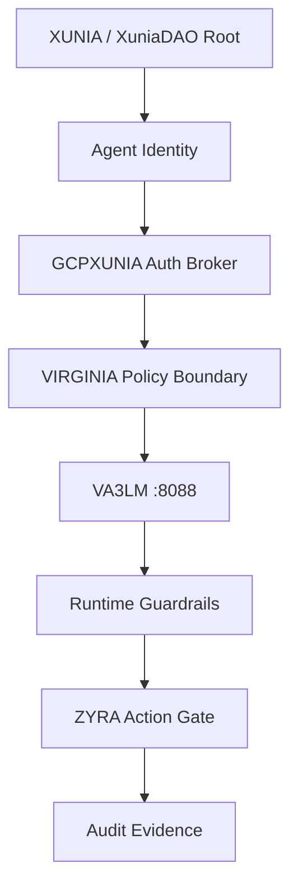

# VA3LM

**Virginia Agentic Large Learning Language Model**

VA3LM is the **VIRGINIA execution and reasoning runtime** inside the XUNIAverse, rooted at [`sonoxo/xuniadao`](https://github.com/sonoxo/xuniadao).

```text
XUNIA → Agent Identity → GCPXUNIA Auth Broker → VIRGINIA Policy Boundary → VA3LM :8088 → Runtime Guardrails → ZYRA Action Gate → Evidence
```

- Port: **8088**
- GPT-DOUG-LLM coding brain
- Agent swarm
- Palantir-style ontology contracts
- GCPXUNIA agent identity + auth broker
- SPIFFE-style first-class agent principals
- Short-lived credential references
- DPoP / mTLS token-binding model
- Least-privilege scope checks
- Runtime security guardrails
- Human approval before consequential write/publish/access actions
- Evidence-first execution claims

## Run

```bash
cd va3lm
python3 -m venv .venv
source .venv/bin/activate
pip install -e '.[dev]'
va3lm serve
```

Open `http://127.0.0.1:8088`.

## GCPXUNIA identity defense

Agent identity and outbound authentication are modeled separately from user identity.

```text
AgentIdentity
  → SPIFFE validation
  → agent scope check
  → provider scope check
  → GCPXUNIA Auth Manager
  → short-lived credential reference
  → DPoP / mTLS binding
  → VIRGINIA policy boundary
  → VA3LM runtime
```

Blocked by policy:

- shared agent credentials
- long-lived agent credentials
- raw secret return from the broker
- broad project/org grants without review
- arbitrary remote shell
- automatic fund movement

Docs: [`docs/GCPXUNIA_AUTH.md`](docs/GCPXUNIA_AUTH.md)

## Interactive command deck

```bash
va3lm agents
va3lm plan "Build a FastAPI endpoint with tests"
va3lm ontology
va3lm explain "VA3LM defense workflow"
```

Optional local model brain:

```bash
export VA3LM_MODEL_URL=http://127.0.0.1:11434/v1
export VA3LM_MODEL_NAME=gpt-doug-llm
va3lm brain "Refactor this service safely"
```

## Defense ontology



Objects include `AgentIdentity`, `AuthProvider`, `AccessPolicy`, `PolicyBoundary`, `VA3LMRuntime`, `Guardrail`, `SecurityEvent`, `Evidence`, `TechnologyPeer`, `SecurityDomain`, and `XuniaverseNode`.

## API

| Method | Route | Purpose |
|---|---|---|
| GET | `/healthz` | health |
| GET | `/api/status` | runtime + identity-defense status |
| GET | `/api/agents` | agent roster |
| GET | `/api/ontology` | VA3LM ontology |
| GET | `/api/defense/ontology` | GCPXUNIA/VIRGINIA defense graph |
| POST | `/api/identity/evaluate` | evaluate agent identity/scope policy |
| POST | `/api/auth/broker` | broker a short-lived credential reference |
| POST | `/api/plan` | build workflow |
| POST | `/api/brain` | ask configured local model |
| POST | `/api/explain` | generate explainer |

## Brain policy

The VA3LM brain now defaults to:

- agent-owned identity before brokered auth
- short-lived credentials
- no shared agent secrets
- least privilege
- separate user delegation
- human review for broad grants and consequential actions
- runtime guardrails
- provenance-bearing evidence
- no unsupported vendor/government deployment or endorsement claims

## Development

```bash
pytest -q
ruff check src tests
bandit -q -ll -r src
```

Architecture references: Google Cloud IAM agent identity/Auth Manager guidance, Google Cloud Security Community IAM material, and public Palantir Ontology documentation. These references do not claim a live Google Cloud or Palantir deployment or vendor endorsement.

Private software project. Not a government agency.
