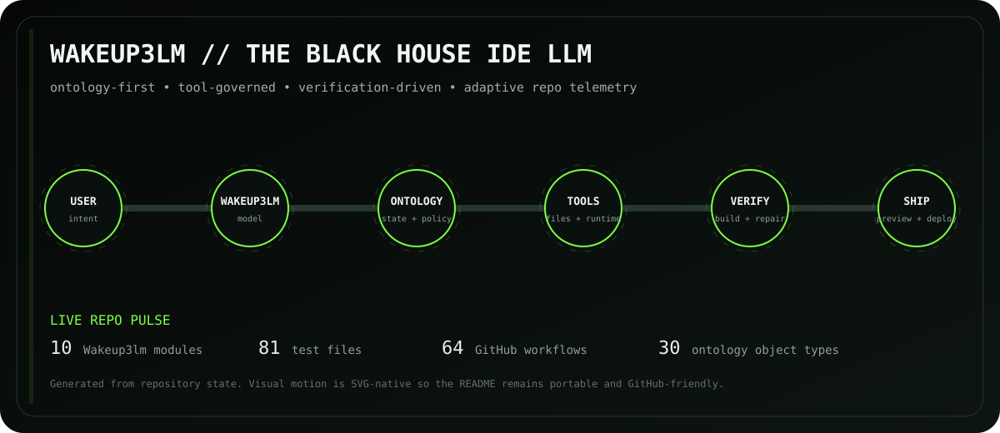

# Wakeup3lm

**Wakeup3lm is The Black House IDE LLM.**

It is not merely a chat panel inside an editor. The LLM owns a governed software-engineering loop:

```text
USER INTENT
  ↓
WAKEUP3LM MODEL
  ↓
ONTOLOGY CONTROL PLANE
  ↓
STRUCTURED AGENT DECISION
  ↓
POLICY + TOOL REGISTRY
  ↓
IDE WORKSPACE
  ↓
RUN / BUILD / PREVIEW / TEST
  ↓
OBSERVE + REPAIR
  ↓
CHECKPOINT
  ↓
DEPLOY
```

<!-- WAKEUP3LM:AUTO:START -->
## Live ecosystem pulse

> Generated automatically from the repository. Last refresh: **2026-09-05 07:01 UTC**

<p align="center"></p>

| State | Capability | Meaning |
| --- | --- | --- |
| ✅ | Ontology kernel | Implemented |
| ✅ | Structured agent decisions | Implemented |
| ✅ | Secure workspace filesystem | Implemented |
| ✅ | Kernel regression CI | Implemented |
| 🧭 | Browser IDE shell | Next layer |
| 🧭 | Monaco editor | Next layer |
| 🧭 | xterm terminal | Next layer |
| 🧭 | Preview gateway | Next layer |
| 🧭 | Deployment adapter | Next layer |

**Repo telemetry:** `8` Wakeup3lm Python modules · `51` test files · `45` workflows · `30` ontology object types.

**Current ontology:** `Action`, `Agent`, `AgentDecision`, `AgentRun`, `Approval`, `Artifact`, `Build`, `Checkpoint`, `CredentialReference`, `Decision`, `Deployment`, `Evidence`, `File`, `Incident`, `IntelligenceBrief`, `Mission`, `Model`, `Policy`, `PolicyDecision`, `Preview`, `Process`, `Project`, `Repository`, `Resource`, `Service`, `Source`, `Tool`, `ToolCall`, `User`, `Workspace`.
<!-- WAKEUP3LM:AUTO:END -->

## Identity

- **System:** Wakeup3lm
- **Role:** IDE-native large language model and coding agent
- **Parent ecosystem:** The Black House / `sonoxo/gpt-doug-llm`
- **Architecture:** ontology-first, tool-governed, verification-driven
- **Primary surface:** browser IDE for websites, full-stack apps and mobile/PWA web apps

## Palantir-style layers

Wakeup3lm uses the architectural primitives associated with an operational Ontology without claiming Palantir licensing, deployment or government authorization.

| Layer | Wakeup3lm role |
| --- | --- |
| Model / AIP-style reasoning | Understand intent, plan and propose structured tool actions |
| Ontology | Durable objects, links, state, policy decisions and provenance |
| Mission/operations view | IDE project state, builds, previews, deployments and agent activity |
| Deployment plane | Build, validate, publish and rollback workflows |
| Analysis workspace | Code editor, terminal, logs, files, database and model context |

## Core ontology

The kernel currently defines these object types:

- Workspace
- Project
- File
- Model
- AgentRun
- AgentDecision
- ToolCall
- Process
- Build
- Preview
- Checkpoint
- Deployment
- PolicyDecision

The rule is simple: **operational nouns become objects; governed verbs become tool/action requests.**

## Invalid agent decisions

Wakeup3lm validates every model action before executing it. The model must produce a structured decision containing:

```json
{
  "action": "write_file",
  "arguments": {"path": "src/app.tsx", "content": "..."},
  "rationale": "implement the requested feature"
}
```

If the model returns malformed JSON, an unknown tool, or invalid arguments, the IDE does not die with an `invalid agent decision` error. Wakeup3lm records a failed `AgentDecision` in the Ontology and returns a structured failure that the repair loop can reason about.

## Working kernel today

Implemented now:

- ontology object/link persistence;
- structured agent-decision validation;
- explicit tool registry;
- project-scoped secure filesystem;
- file read/write/delete/list/search tools;
- path traversal rejection;
- ToolCall + AgentDecision audit state;
- regression tests for invalid decisions, path escape, tool execution and persisted ontology state.

This is the kernel. It does **not** claim that Monaco, xterm.js, container runners, preview proxy, auth, database UI or deployment adapters are complete yet.

## Build sequence

The Wakeup3lm product follows the source specification in this order:

1. ontology/model runtime and project persistence;
2. project filesystem + editor;
3. runner + terminal + process/log manager;
4. real preview proxy;
5. model provider + full tool loop + automatic repair;
6. chat/tool execution UI;
7. templates + create-with-AI;
8. checkpoints/rollback;
9. mobile/PWA workflows;
10. deployment;
11. security hardening;
12. E2E acceptance suite.

## Black House contract

Wakeup3lm inherits The Black House rules already used by the fleet:

- no ambient authority;
- least privilege;
- human gates for consequential actions;
- explicit tools instead of imaginary capabilities;
- provenance and auditable state;
- fail closed when identity, permissions or environment are unknown;
- never claim government, intelligence-community or Palantir authorization unless independently verified.

## Optional browser Studio and project memory

[Black House Studio / Orbit](../docs/BLACK_HOUSE_STUDIO.md) connects the browser coding surface, a bounded Ollama-compatible model bridge, and project-scoped shared memory. The deployed Studio currently retains its owner-private audience; this repository does not provision a shared cloud model.

Use `python3 -m wakeup3lm.bridge` to serve an existing Ollama installation to explicitly allowed browser origins. Configure `memory_path` outside the agent workspace when constructing `Wakeup3LM` to enable SQLite memory and the `recall_memory` / `remember_memory` tools. The browser's `black-house.memory.v1` export can be imported with `ProjectMemory.import_payload` into the matching project ID. Memory remains context, with human/model/imported provenance, and does not grant tool authority.
