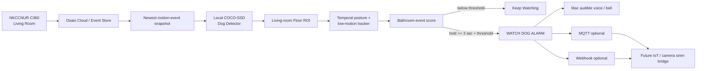
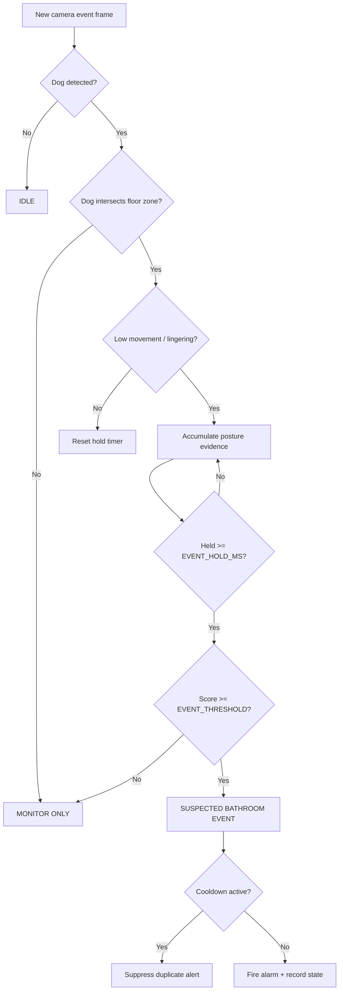
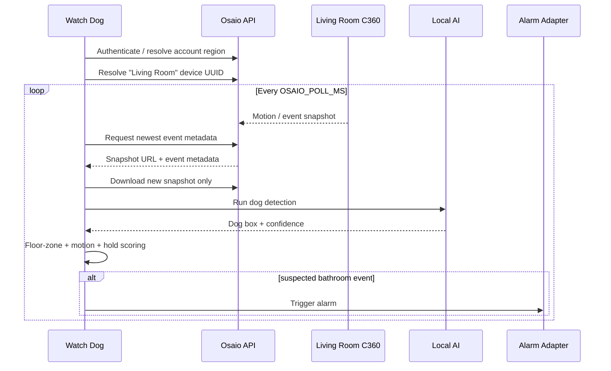
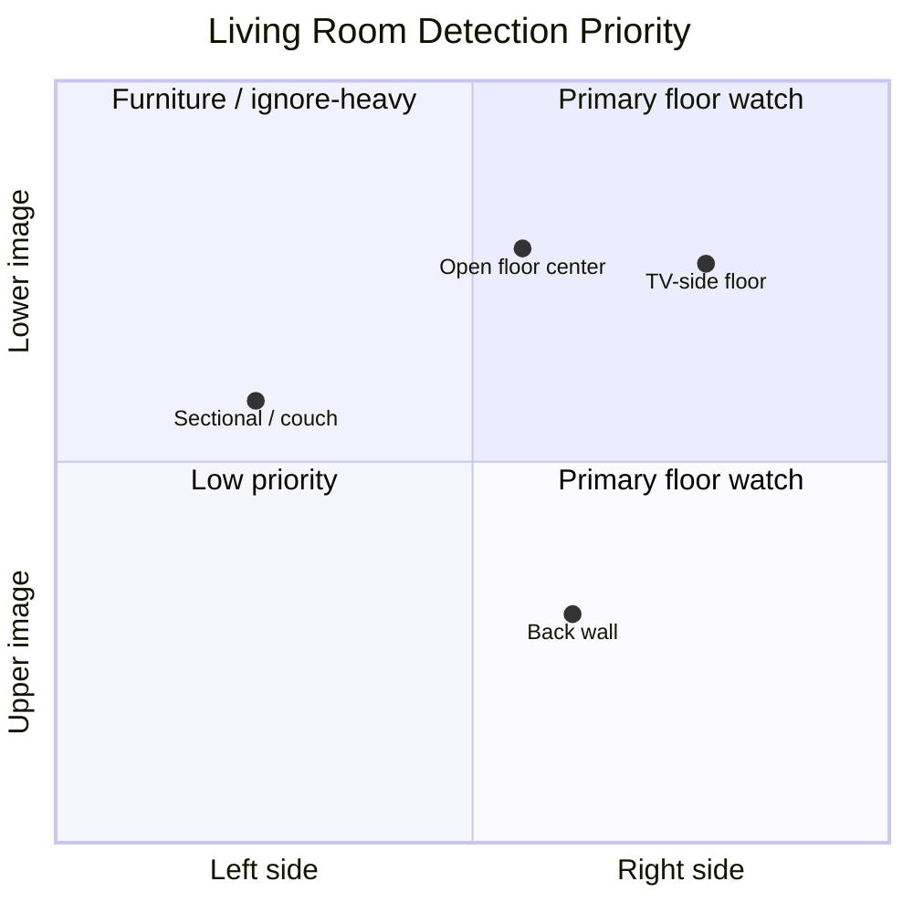
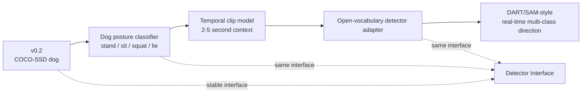
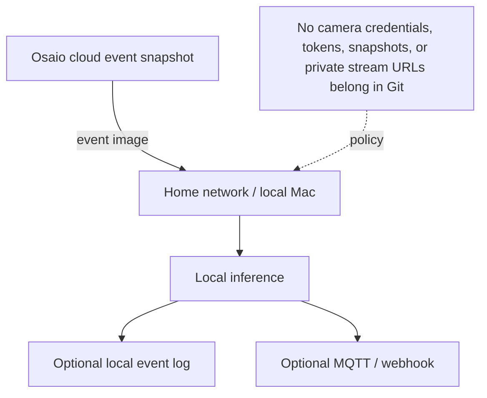
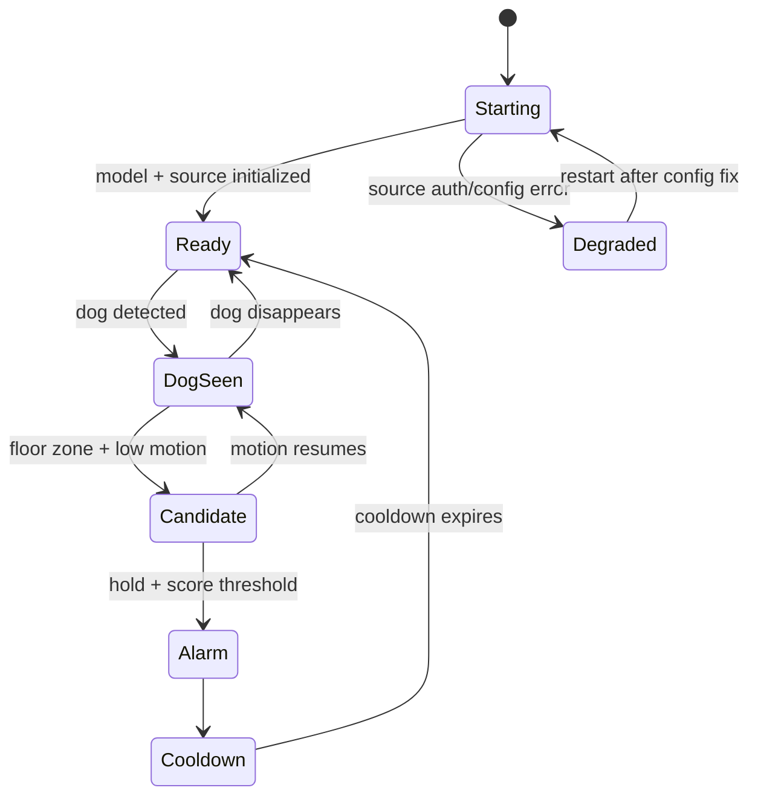

# GPT-DOUG-LLLM Watch Dog — Visual Architecture

Reference direction supplied by the project owner:

- https://x.com/rsasaki0109/status/2093677539705409827
- https://x.com/rsasaki0109/status/2093678821656646043

These diagrams are project-specific architecture visuals. They do not copy source code or model weights from the referenced work.

## 1. Live system map



## 2. Detection decision graph



## 3. Osaio integration path



## 4. Living-room region model

The supplied camera view is treated as a normalized frame. The starting ROI is intentionally conservative and must be calibrated after real events.



Runtime rectangle:

```text
FLOOR_ZONE=0.18,0.40,0.98,1
```

Coordinates are normalized `x1,y1,x2,y2` values from 0 to 1.

## 5. Detector evolution — current to DART-style direction



The detector boundary should stay replaceable so the runtime, alerting, camera ingestion, cooldown, and API layers do not depend on one model family.

## 6. Privacy boundary



## 7. Operational state machine



## Status

- GitHub architecture visual: implemented
- Osaio event source: implemented on the feature branch
- local dog inference: implemented
- Mac audible alarm: implemented
- exact C360 built-in siren command: not yet proven
- posture-specific training data: not yet collected
