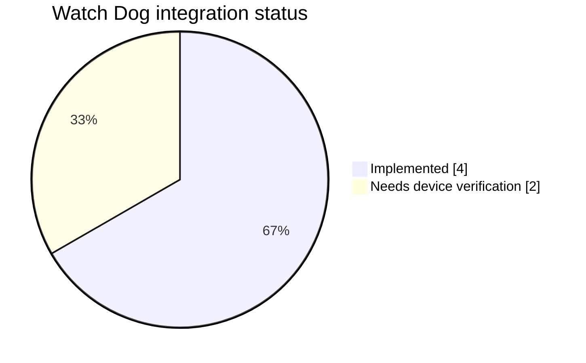

# Watch Dog Status

```mermaid
pie showData
    title Watch Dog integration status
    "Implemented" : 4
    "Needs device verification" : 2
```

Implemented: Osaio event adapter, local dog detection, temporal scoring, macOS alarm.

Needs device verification: exact C360 siren command, posture-specific calibration.
