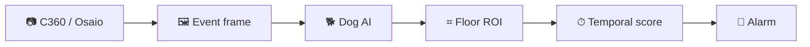
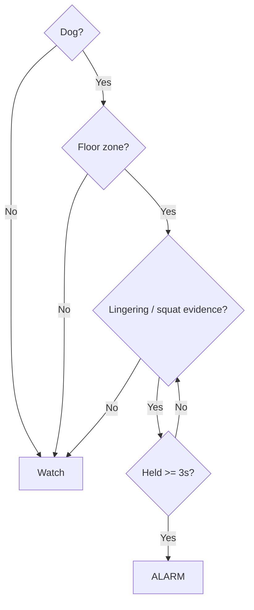

# Watch Dog Visual Quick Reference

```mermaid
flowchart LR
    A["📷 C360 / Osaio"] --> B["🖼 Event frame"] --> C["🐕 Dog AI"] --> D["⌗ Floor ROI"] --> E["⏱ Temporal score"] --> F["🚨 Alarm"]
```

```mermaid
flowchart TB
    D{"Dog?"} -->|No| W["Watch"]
    D -->|Yes| Z{"Floor zone?"}
    Z -->|No| W
    Z -->|Yes| H{"Lingering / squat evidence?"}
    H -->|No| W
    H -->|Yes| T{"Held >= 3s?"}
    T -->|No| H
    T -->|Yes| A["ALARM"]
```

See [`ARCHITECTURE.md`](ARCHITECTURE.md) for the full visual system map.
